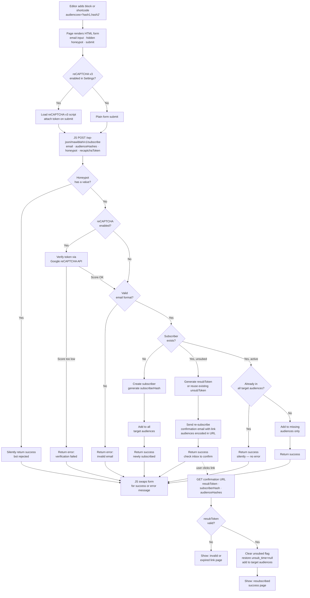

# 1.0.17 — Subscription Form

## Overview

Native subscription form embeddable anywhere via a WordPress shortcode or Gutenberg block. Supports multiple audiences, honeypot + optional reCAPTCHA v3 spam protection, and a re-subscribe confirmation flow for previously unsubscribed users.

---

## User Flow



---

## Shortcode

```
[mawiblah_subscribe_form audiences="hash1,hash2"]
```

- `audiences` — comma-separated `audienceHash` values (plural, matches campaign field naming)
- Omitting `audiences` subscribes without assigning to any audience

## Gutenberg Block

- Block name: `mawiblah/subscription-form`
- Block attribute: `audiences` (array of audienceHash strings)
- Editor UI: multi-select dropdown populated from `getAllAudiences()`, displays audience name, stores hash
- Renders via `render_callback` — same output as shortcode (no duplication)
- No build step — registered with `wp.blocks.registerBlockType` in vanilla JS

---

## HTML Structure & CSS Classes

```html
<div class="mawiblah-subscribe-form">

  <form class="mawiblah-subscribe-form__form">
    <!-- honeypot: hidden via inline style so it survives theme CSS resets -->
    <input type="text" name="website" style="display:none" tabindex="-1" autocomplete="off" />

    <div class="mawiblah-subscribe-form__field">
      <label class="mawiblah-subscribe-form__label" for="mawiblah-email">Email</label>
      <input class="mawiblah-subscribe-form__input"
             type="email" id="mawiblah-email" name="email"
             placeholder="your@email.com" required />
    </div>

    <div class="mawiblah-subscribe-form__actions">
      <button class="mawiblah-subscribe-form__button" type="submit">Subscribe</button>
    </div>
  </form>

  <div class="mawiblah-subscribe-form__message mawiblah-subscribe-form__message--success" hidden></div>
  <div class="mawiblah-subscribe-form__message mawiblah-subscribe-form__message--error" hidden></div>

</div>
```

**State modifiers added by JS to the wrapper:**
- `mawiblah-subscribe-form--loading` — while fetch is in flight
- `mawiblah-subscribe-form--submitted` — after success (theme can hide the form)

**CSS philosophy:** box-model only (display, width, margin) — no colours, no fonts, no borders. Enqueued only on pages that contain the shortcode or block.

---

## REST Endpoint

`POST /wp-json/mawiblah/v1/subscribe` — public, no auth required

**Request:**
```json
{
  "email": "user@example.com",
  "audienceHashes": ["hash1", "hash2"],
  "honeypot": "",
  "recaptchaToken": "..."
}
```

**Responses:**
```json
{ "status": "ok",    "message": "You are now subscribed!" }
{ "status": "ok",    "message": "Check your inbox to confirm your subscription." }
{ "status": "error", "message": "Invalid email address." }
{ "status": "error", "message": "Verification failed. Please try again." }
```

---

## Audience Hash

Audiences (taxonomy terms) currently have no hash. A new `audienceHash` (MD5 of `term_id`) will be added, consistent with `subscriberHash` and `campaignHash`.

- Generated lazily in `appendAudienceMeta()` on first access, stored via `add_term_meta`
- Never changes (derived from immutable term_id)
- Preferred over slug (slug is mutable — editor rename would silently break shortcodes)

---

## Re-subscribe Confirmation

Triggered when a submitted email is found with `unsubed = true`.

- Reuses existing `unsubToken` stored on the subscriber (no new meta field needed)
- Sends a confirmation email with a link containing `resubToken`, `subscriberHash`, `audienceHashes`
- URL handler added to `SubscriptionForm::init()` (mirrors `Unsubscribe::init()` pattern)
- On confirmation: clears `unsubed` flag, nulls `unsub_time`, adds to target audiences
- Invalid/missing token → shows error page

---

## Spam Protection

### Honeypot (always active)
- Hidden `<input name="website">` rendered inline-hidden
- Server rejects silently if value is non-empty (returns success to fool bots)

### reCAPTCHA v3 (optional)
- Enabled via Settings — requires site key + secret key
- JS loads `https://www.google.com/recaptcha/api.js` only when enabled
- Token attached to form submission, verified server-side via Google API
- Score threshold: `0.5` (configurable via constant `MAWIBLAH_RECAPTCHA_THRESHOLD`)

---

## Settings — New Section

Added to `config/sections.json`:

```json
{
  "id": "mawiblah-recaptcha",
  "title": "reCAPTCHA v3 (Subscription Form)",
  "description": "Optional Google reCAPTCHA v3 for the subscription form. Leave disabled to rely on honeypot only.",
  "fields": [
    {
      "id": "mawiblah-recaptcha-enabled",
      "title": "Enable reCAPTCHA v3",
      "type": "select",
      "value": "",
      "default_value": "disabled",
      "options": [
        { "value": "disabled", "title": "Disabled" },
        { "value": "enabled",  "title": "Enabled" }
      ]
    },
    {
      "id": "mawiblah-recaptcha-site-key",
      "title": "Site Key",
      "type": "text",
      "value": "",
      "placeholder": "6Lc...",
      "default_value": ""
    },
    {
      "id": "mawiblah-recaptcha-secret-key",
      "title": "Secret Key",
      "type": "text",
      "value": "",
      "placeholder": "6Lc...",
      "default_value": ""
    }
  ]
}
```

New getters in `Settings.php`:
- `Settings::recaptchaEnabled(): bool`
- `Settings::recaptchaSiteKey(): string`
- `Settings::recaptchaSecretKey(): string`

---

## Files

### New
| File | Purpose |
|---|---|
| `classes/SubscriptionForm.php` | REST endpoint, honeypot check, reCAPTCHA verify, subscribe logic, resubscribe confirmation handler |
| `templates/subscription-form/form.php` | HTML form template |
| `templates/subscription-form/resubscribe-confirm.php` | Re-subscribe confirmation success page |
| `templates/subscription-form/resubscribe-invalid.php` | Invalid/expired token page |
| `assets/css/subscription-form.css` | Minimal front-end styles (box-model only) |
| `assets/js/subscription-form.js` | Fetch submit, reCAPTCHA token attach, DOM swap |
| `assets/js/block/subscription-form.js` | Gutenberg block registration (vanilla JS) |

### Modified
| File | Change |
|---|---|
| `mawiblah.php` | `require` new class, version bump `1.0.16` → `1.0.17` |
| `classes/ShortCodes.php` | Register `[mawiblah_subscribe_form]` |
| `classes/Init.php` | Register REST route `/subscribe`, `register_block_type()`, enqueue front-end assets conditionally |
| `classes/Settings.php` | Add `recaptchaEnabled()`, `recaptchaSiteKey()`, `recaptchaSecretKey()` |
| `classes/Subscribers.php` | Add `audienceHash` to `appendAudienceMeta()` (lazy generate + persist) |
| `config/sections.json` | Add reCAPTCHA section |

---

## Documentation Updates (last step)

| File | Change |
|---|---|
| `mawiblah.php` | Version bump to `1.0.17` |
| `README.md` | Add feature bullet, update comparison table Form Integration row, add `### --- 1.0.17 ---` changelog entry |
| `readme.txt` | Bump `Stable tag`, add to Key Features, add `= 1.0.17 =` changelog entry |
| `DOCUMENTATION.md` | Add Subscription Form section: shortcode usage, block usage, class names, settings keys, REST shape |

---

## Test Coverage Review

### Currently covered

Only 4 methods in `Campaigns`, all in one auto-running flat block:

| Class | Method | Covered |
|---|---|---|
| Campaigns | `addCampaign` | ✅ |
| Campaigns | `getCampaign` | ✅ |
| Campaigns | `getCampaigns` | ✅ |
| Campaigns | `deleteCampaign` | ✅ |

Everything else is untested.

---

### Not covered — by priority

#### 🔴 High (core business logic, user-facing risk)

**Campaigns**
- `validateCampaign` — validation rules for title/subject/audiences/template
- `testStart / testFinish / testApprove / testReset` — workflow state transitions
- `campaignStart / campaignFinish` — send lifecycle, guard against double-start
- `updateCounters / getCounters` — counter accuracy across sent/failed/skipped/unsubed
- `incrementNewlyUnsubed` — unsubscribe attribution per campaign
- `lockTemplate / fillTemplate` — placeholder replacement: `{campaignHash}`, `{subscriberHash}`, `{email}`
- `linkClicked` — triple-count logic (total / unique-per-session / unique-per-user)

**Subscribers**
- `addSubscriber` — creation, hash generation, duplicate guard
- `getSubscriber / getSubscriberById / getSubscriberBySubscriberHash` — lookup paths
- `appendMeta` — `audienceHash` lazy generation + idempotency (new)
- `addSubscriberToAudience` — taxonomy assignment + `unsubed` sync side-effect
- `unsub` — token check, flag set, audience assignment, feedback storage
- `isEmailSent` — prevents double-send
- `isTester` — gates test-mode sending
- `getUnsubToken` — lazy generation + persistence
- `unsubedAudience / testerAudience` — special audience lookups

**Unsubscribe flow**
- `Unsubscribe::unsubscribe()` — subscriber found vs not found, GravityForms fallback, token generation
- `Unsubscribe::unsubscribeAprooved()` — token valid, already unsubed, campaign counter increment

**RestRoutes**
- `sendEmail` — all 7 skip/send paths: unsubscribed, already sent, do-not-disturb, not tester in test mode, email sending disabled, template failure, success, failure

#### 🟡 Medium (correctness matters, lower change frequency)

**Helpers**
- `generateSubscriberHash / generateCampaignHash` — deterministic, consistent output
- `trackingParams` — URL encoding, param merging
- `emailSendingStats` — correct shape returned for each path

**Visits**
- `visit()` — session-based deduplication: `linksClickedTotal` always incremented, `linksClicked` only once per URL per session, `uniqueUserClicks` only once per subscriber per campaign

**Subscribers**
- `validateAudiences` — rejects invalid term IDs, rejects empty array
- `getSubscriberGrowthStats` — 12-month bucketing logic
- `getUnsubscribeReasons` — returns correct structure

**Campaigns**
- `getCampaignByHash` — lookup by `campaignHash` not post ID
- `getLastCampaigns` — ordering + limit respected
- `getStatsForCampaign / getConversionStatsForCampaign` — stat shapes correct

#### 🟢 Low (infrastructure, rarely changes)

**Settings**
- `getOption` — returns saved value, falls back to `default_value`
- `sendEmails / dontDisturbThreshold` — correct option keys read

**Migrations**
- `migrateTo1016` — `subscriberId` → `subscriberHash` rename, no data loss, idempotent (safe to run twice)

**GravityForms**
- Skip — relies on GravityForms being installed; mock-heavy, low value

**Logs / Renderer / Actions**
- Skip — output/rendering classes, not logic

---

### Suggested new scenarios (additions to `Tests.php` + PHPUnit)

| Scenario | Layer 1 (in-browser) | Layer 2 (PHPUnit) |
|---|---|---|
| `campaignScenario` | refactor existing | mirror as PHPUnit |
| `campaignWorkflowScenario` | test/start/finish/approve/reset | ✅ |
| `campaignCountersScenario` | updateCounters, getCounters, incrementNewlyUnsubed | ✅ |
| `campaignTemplateScenario` | lockTemplate, fillTemplate placeholder replacement | ✅ |
| `subscriberScenario` | add, get, hash generation, audience assignment | ✅ |
| `unsubscribeScenario` | full token flow, already-unsubed guard | ✅ |
| `clickTrackingScenario` | triple-count logic via Visits::visit() | ✅ |
| `subscriptionFormScenario` | all 9 new form cases | ✅ |
| `migrationScenario` | migrateTo1016 idempotency | PHPUnit only |

---

## Testing Strategy

Three layers, all opt-in (button-triggered, never auto-run on page load).

---

### Layer 1 — In-browser integration tests (Tests.php refactor)

**Current problems to fix first:**
- `Tests::tests()` auto-fires on every page load — needs to move behind a `?run=` param check
- Everything is one flat method — needs splitting into named scenarios
- `tests.php` template calls `Tests::tests()` directly — replace with a scenario button grid

**New structure:**

`tests.php` template renders a button per scenario. Clicking a button reloads the page with `?run=scenario-name`. The template checks for `?run=` and fires only that scenario. No `?run=` → just show the buttons and the settings table.

```
?page=mawiblah-tests                    → show buttons + settings table
?page=mawiblah-tests&run=campaigns      → run campaign scenario only
?page=mawiblah-tests&run=subscribers    → run subscriber scenario only
?page=mawiblah-tests&run=subscription-form → run subscription form scenario
```

**Existing scenarios to extract from `Tests::tests()`:**
- `Tests::campaignScenario()` — create / find / count / delete campaigns (existing logic)

**New scenarios for subscription form:**
- `Tests::subscriberScenario()` — create subscriber, check audienceHash generation, cleanup
- `Tests::subscriptionFormScenario()` — covers:
  - New email → subscriber created, added to correct audiences ✓
  - Same email again → silent success, no duplicate ✓
  - Honeypot filled → subscriber NOT created ✓
  - Invalid email format → subscriber NOT created ✓
  - Unsubscribed email → no re-subscribe yet, re-confirm email triggered ✓
  - Re-subscribe token valid → `unsubed` cleared, added to audiences ✓
  - Re-subscribe token invalid → rejected ✓
  - Multiple audiences → subscriber added to all target audiences ✓
  - Partial overlap → subscriber added only to missing audiences ✓

Each scenario: creates its own test data, asserts, cleans up. Self-contained.

---

### Layer 2 — PHPUnit integration tests

New files required:
```
composer.json                  — require phpunit/phpunit + yoast/wp-test-utils or brain/monkey
phpunit.xml.dist               — bootstrap, test suite config
tests/bootstrap.php            — load WP environment
tests/Integration/
    SubscriptionFormTest.php   — mirrors Layer 1 scenarios but as proper PHPUnit assertions
    SubscriberAudienceHashTest.php — audienceHash generation + idempotency
```

Tests run against the real WordPress database (integration, not unit). Same scenarios as Layer 1 but expressed as `assertSame`, `assertTrue`, `assertCount` etc. — runnable in CI via `composer test`.

**`composer.json` deps:**
```json
{
  "require-dev": {
    "phpunit/phpunit": "^10",
    "wp-phpunit/wp-phpunit": "^6"
  },
  "scripts": {
    "test": "phpunit"
  }
}
```

---

### Layer 3 — Jest (frontend JS unit tests)

New files required:
```
package.json                            — jest + jsdom
tests/js/subscription-form.test.js     — covers frontend JS behaviour
```

**Scenarios:**
- Form submit sends correct POST payload (email, audienceHashes, honeypot field empty)
- Honeypot field is present in DOM but not user-visible
- Success response → form hidden, success message shown
- Error response → error message shown, form stays visible
- Loading state → button disabled while fetch in flight
- reCAPTCHA token attached to payload when grecaptcha is available

**`package.json` deps:**
```json
{
  "devDependencies": {
    "jest": "^29",
    "jest-environment-jsdom": "^29"
  },
  "scripts": {
    "test": "jest"
  }
}
```

---

## Files — Testing additions

### New
| File | Purpose |
|---|---|
| `composer.json` | PHPUnit + wp-phpunit deps |
| `phpunit.xml.dist` | PHPUnit config |
| `tests/bootstrap.php` | WP environment loader for PHPUnit |
| `tests/Integration/SubscriptionFormTest.php` | PHPUnit integration tests |
| `tests/Integration/SubscriberAudienceHashTest.php` | audienceHash PHPUnit tests |
| `tests/js/subscription-form.test.js` | Jest frontend tests |
| `package.json` | Jest deps |

### Modified
| File | Change |
|---|---|
| `classes/Tests.php` | Split `tests()` into named scenario methods, add `subscriptionFormScenario()` |
| `templates/tests.php` | Replace auto-run with scenario button grid + `?run=` param dispatch |

---

## Test Implementation

### Layer 1 — Tests.php refactor

**`templates/tests.php` — new structure**

Remove the direct `Tests::tests()` call. Replace with:
1. Settings table (keep as-is)
2. Scenario button grid — one button per scenario
3. `?run=` param dispatch — renders results below the buttons

```php
$scenario = isset($_GET['run']) ? sanitize_key($_GET['run']) : null;
$scenarios = [
    'campaigns'          => 'Campaign CRUD',
    'campaign-workflow'  => 'Campaign Workflow (test/approve/start/finish)',
    'campaign-counters'  => 'Campaign Counters',
    'campaign-template'  => 'Campaign Template & Placeholders',
    'subscribers'        => 'Subscriber CRUD & Audience Hash',
    'unsubscribe'        => 'Unsubscribe Flow',
    'click-tracking'     => 'Click Tracking (triple-count)',
    'subscription-form'  => 'Subscription Form',
];
// render buttons
// if $scenario → call Tests::run($scenario)
```

**`Tests::run(string $scenario): void`** — dispatcher added to `Tests.php`:
```php
public static function run(string $scenario): void {
    match($scenario) {
        'campaigns'         => self::campaignScenario(),
        'campaign-workflow' => self::campaignWorkflowScenario(),
        'campaign-counters' => self::campaignCountersScenario(),
        'campaign-template' => self::campaignTemplateScenario(),
        'subscribers'       => self::subscriberScenario(),
        'unsubscribe'       => self::unsubscribeScenario(),
        'click-tracking'    => self::clickTrackingScenario(),
        'subscription-form' => self::subscriptionFormScenario(),
        default             => self::echoResult('Unknown scenario', 'error'),
    };
}
```

Each scenario method follows the same structure:
```php
public static function xyzScenario(): void {
    self::echoHeading('XYZ');
    // 1. setup  — create test data
    // 2. assert — echoResult(pass/fail)
    // 3. cleanup — delete test data
}
```

---

### Scenario specs

#### `campaignScenario` (extract + clean up existing)
- Setup: record campaign count before
- Assert: `addCampaign` returns a post ID
- Assert: `getCampaign($title)` finds it by title
- Assert: `getCampaign($otherTitle)` returns null
- Assert: `getCampaigns()` count increased by exactly 2
- Assert: `getCampaignByHash($hash)` finds by hash
- Assert: `isUnique($title)` returns false for existing, true for new
- Cleanup: `deleteCampaign` × 2, count returns to baseline

#### `campaignWorkflowScenario`
- Setup: create one campaign
- Assert: `testStarted` is false before `testStart()`
- Assert: after `testStart()` — `testStarted` is a timestamp
- Assert: after `testFinish()` — `testFinished` is a timestamp
- Assert: after `testApprove()` — `testApproved` is a timestamp, `testMode` resolves to false
- Assert: after `testReset()` — all three timestamps are false again
- Assert: `campaignStart()` sets `campaignStarted`; calling it twice doesn't overwrite (guard check)
- Assert: `campaignFinish()` sets `campaignFinished`
- Cleanup: delete campaign

#### `campaignCountersScenario`
- Setup: create one campaign, zero counters
- Assert: `getCounters()` returns object with all fields as 0
- Assert: `updateCounters($c, 5, 1, 2, 1)` → `getCounters()` reflects new values
- Assert: `incrementNewlyUnsubed()` → `emailsNewlyUnsubed` increases by 1
- Assert: calling `updateCounters` again overwrites (not additive)
- Cleanup: delete campaign

#### `campaignTemplateScenario`
- Setup: create campaign + subscriber with known hashes
- Assert: `fillTemplate` replaces `{campaignHash}` with campaign's hash
- Assert: `fillTemplate` replaces `{subscriberHash}` with subscriber's hash
- Assert: `fillTemplate` replaces `{email}` with subscriber's email
- Assert: URL-encoded variants `%7BcampaignHash%7D` also replaced
- Assert: `lockTemplate` returns false when template doesn't exist
- Cleanup: delete campaign + subscriber

#### `subscriberScenario`
- Setup: none (uses test email)
- Assert: `addSubscriber('test@mawiblah.test')` returns subscriber object
- Assert: `getSubscriber('test@mawiblah.test')` finds it
- Assert: `getSubscriberById($id)` finds it
- Assert: `getSubscriberBySubscriberHash($hash)` finds it
- Assert: `appendMeta()` includes `audienceHash` on audience objects
- Assert: calling `appendMeta()` twice returns same `audienceHash` (idempotent)
- Assert: `addSubscriber` with same email does NOT create a duplicate
- Assert: `getUnsubToken($id)` generates and persists token; second call returns same token
- Assert: `isEmailSent($subId, $campaignId)` returns false before, true after `sentEmail()`
- Assert: `isTester()` returns false by default; true after `addSubscriberToAudience(testerAudienceId)`
- Cleanup: delete subscriber

#### `unsubscribeScenario`
- Setup: create subscriber, create campaign
- Assert: `unsub($email, $wrongToken, '')` returns false, `unsubed` stays false
- Assert: `unsub($email, $correctToken, 'feedback text')` returns true
- Assert: subscriber `unsubed === true`, `unsub_time` is set
- Assert: subscriber added to `unsubedAudience`
- Assert: `unsubed_feedback` stored on subscriber
- Assert: `incrementNewlyUnsubed($campaignId)` → counter increases
- Assert: calling `unsub` again on already-unsubed subscriber — `Unsubscribe::unsubscribeAprooved` shows already-unsubed path
- Cleanup: delete subscriber + campaign

#### `clickTrackingScenario`
- Setup: create campaign, create subscriber
- Assert: before any visit — `linksClickedTotal`, `linksClicked`, `uniqueUserClicks` all 0
- Assert: after `Visits::visit($campaignHash, $subscriberHash, $url)`:
  - `linksClickedTotal` = 1
  - `linksClicked` = 1
  - `uniqueUserClicks` = 1
- Assert: same subscriber, same URL again — `linksClickedTotal` = 2, others stay at 1
- Assert: same subscriber, different URL — `linksClickedTotal` = 3, `linksClicked` = 2, `uniqueUserClicks` = 1
- Assert: different subscriber, any URL — `uniqueUserClicks` = 2
- Cleanup: delete campaign + subscribers

#### `subscriptionFormScenario`
- Setup: create 2 test audiences with known `audienceHash` values
- Assert: new email → `SubscriptionForm::subscribe()` returns `ok`, subscriber exists, added to both audiences
- Assert: same email again (active) → returns `ok` silently, still only 1 subscriber record
- Assert: same email, one new audience → added to new audience, existing membership unchanged
- Assert: honeypot filled → returns `ok` silently, no subscriber created
- Assert: invalid email `'not-an-email'` → returns `error`, no subscriber created
- Assert: mark subscriber as `unsubed`, resubmit → returns `ok` (check inbox), subscriber still unsubed (awaiting confirm)
- Assert: re-subscribe with valid `resubToken` → `unsubed` cleared, added to audiences
- Assert: re-subscribe with invalid token → rejected
- Assert: multiple audiences in one call → subscriber added to all of them
- Cleanup: delete test subscribers + audiences

---

### Layer 2 — PHPUnit class structure

**`tests/Integration/SubscriptionFormTest.php`**
```php
class SubscriptionFormTest extends WP_UnitTestCase {
    private array $testAudiences = [];
    private array $testSubscribers = [];

    public function setUp(): void { /* create shared fixtures */ }
    public function tearDown(): void { /* delete all fixtures */ }

    public function test_new_subscriber_is_created(): void {}
    public function test_duplicate_submission_is_silent(): void {}
    public function test_honeypot_rejects_silently(): void {}
    public function test_invalid_email_returns_error(): void {}
    public function test_unsubscribed_email_triggers_resubscribe_email(): void {}
    public function test_valid_resub_token_clears_unsubed_flag(): void {}
    public function test_invalid_resub_token_is_rejected(): void {}
    public function test_subscriber_added_to_multiple_audiences(): void {}
    public function test_partial_audience_overlap_adds_missing_only(): void {}
}
```

**`tests/Integration/SubscriberTest.php`**
```php
class SubscriberTest extends WP_UnitTestCase {
    public function test_audience_hash_is_generated_lazily(): void {}
    public function test_audience_hash_is_idempotent(): void {}
    public function test_add_subscriber_no_duplicate(): void {}
    public function test_unsub_token_persists(): void {}
    public function test_is_email_sent_flag(): void {}
}
```

**`tests/Integration/CampaignTest.php`**
```php
class CampaignTest extends WP_UnitTestCase {
    public function test_campaign_workflow_state_transitions(): void {}
    public function test_counters_update_correctly(): void {}
    public function test_fill_template_replaces_all_placeholders(): void {}
    public function test_campaign_start_guard_against_double_start(): void {}
}
```

**`tests/Integration/ClickTrackingTest.php`**
```php
class ClickTrackingTest extends WP_UnitTestCase {
    public function test_total_increments_every_click(): void {}
    public function test_unique_per_session_deduplicates_same_url(): void {}
    public function test_unique_user_counted_once_per_subscriber(): void {}
}
```

---

### Layer 3 — Jest structure

**`tests/js/subscription-form.test.js`**
```js
describe('subscription form', () => {
    describe('submit payload', () => {
        it('sends email and audienceHashes in POST body')
        it('honeypot field is present in DOM but value is empty on normal submit')
        it('attaches recaptcha token to payload when grecaptcha is available')
        it('does not include recaptcha token when grecaptcha is absent')
    })
    describe('DOM state', () => {
        it('adds loading class to wrapper while fetch is in flight')
        it('disables submit button while loading')
        it('shows success message and hides form on ok response')
        it('shows error message and keeps form visible on error response')
        it('removes loading class after fetch resolves')
    })
    describe('honeypot', () => {
        it('honeypot input has display:none inline style')
        it('honeypot input has tabindex=-1')
    })
})
```

---

## Implementation Order

1. `classes/Subscribers.php` — `audienceHash` in `appendAudienceMeta()`
2. `config/sections.json` — reCAPTCHA settings section
3. `classes/Settings.php` — three new getters
4. `classes/SubscriptionForm.php` — REST endpoint + resubscribe handler
5. `templates/subscription-form/` — form + confirmation templates
6. `assets/css/subscription-form.css` — minimal styles
7. `assets/js/subscription-form.js` — frontend JS
8. `assets/js/block/subscription-form.js` — Gutenberg block
9. `classes/ShortCodes.php` + `classes/Init.php` + `mawiblah.php` — wire up
10. **Tests refactor** — split `Tests.php` into scenarios, button-triggered template
11. **Layer 1** — `Tests::subscriptionFormScenario()` in-browser tests
12. **Layer 2** — `composer.json`, PHPUnit setup, `SubscriptionFormTest.php`
13. **Layer 3** — `package.json`, Jest setup, `subscription-form.test.js`
14. Documentation — README, readme.txt, DOCUMENTATION.md
