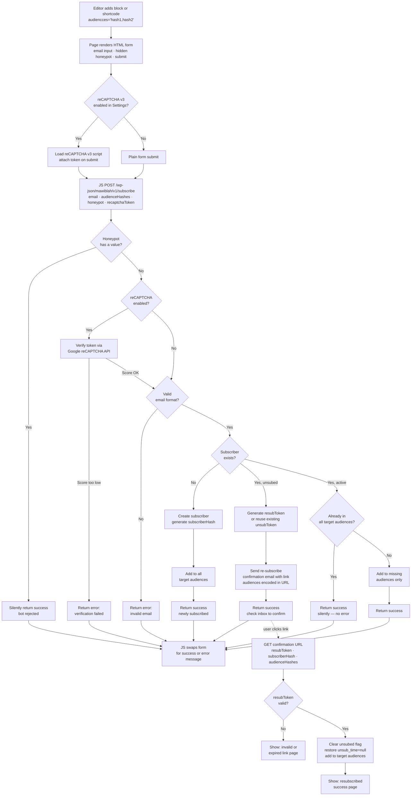
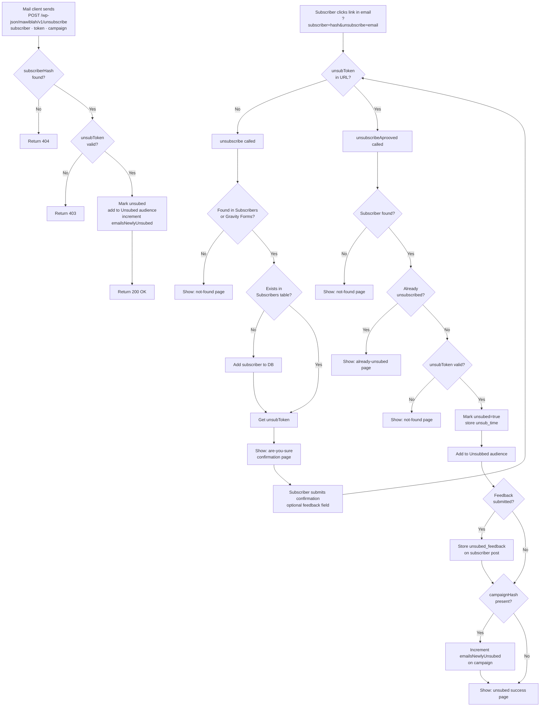
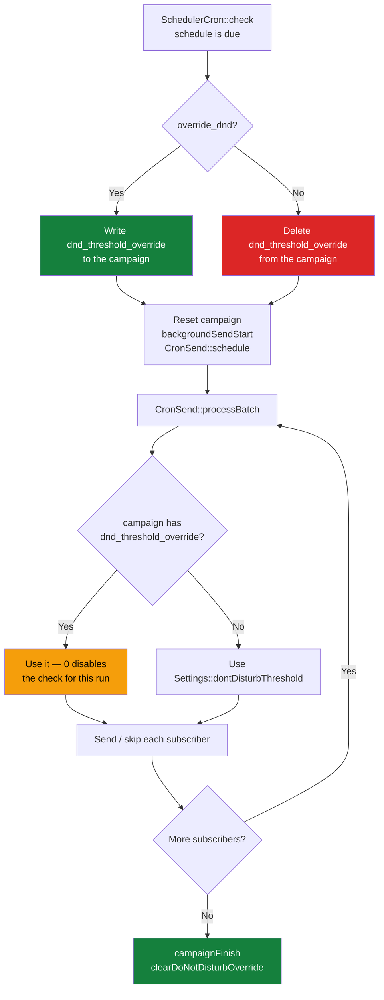

# MAWIBLAH Documentation

## Table of Contents
- [Features Overview](#features-overview)
- [User Flow Diagrams](#user-flow-diagrams)
  - [Subscription Form](#subscription-form)
  - [Campaign Lifecycle](#campaign-lifecycle)
  - [Unsubscribe Flow](#unsubscribe-flow)
- [Campaign Fields & Counters](#campaign-fields--counters)
- [Click Tracking](#click-tracking)
- [Email Templates](#email-templates)
- [Subscriber Management](#subscriber-management)
- [Scheduler](#scheduler)
- [Settings](#settings)

## Features Overview

MAWIBLAH is a WordPress email campaign plugin that provides basic email marketing functionality without recurring costs.

## User Flow Diagrams

### Subscription Form

Shows how the shortcode / Gutenberg block renders a subscribe form and processes submissions. Includes honeypot spam protection, optional reCAPTCHA v3, multiple audience support, and re-subscribe confirmation for previously unsubscribed users.


```mermaid
flowchart TD
    A[Editor adds block or shortcode\naudiencces='hash1,hash2'] --> B[Page renders HTML form\nemail input · hidden honeypot · submit]
    B --> C{reCAPTCHA v3\nenabled in Settings?}
    C -- Yes --> D[Load reCAPTCHA v3 script\nattach token on submit]
    C -- No --> E[Plain form submit]
    D & E --> F[JS POST /wp-json/mawiblah/v1/subscribe\nemail · audienceHashes · honeypot · recaptchaToken]

    F --> G{Honeypot\nhas a value?}
    G -- Yes --> H[Silently return success\nbot rejected]
    G -- No --> I{reCAPTCHA\nenabled?}
    I -- Yes --> J[Verify token via\nGoogle reCAPTCHA API]
    J -- Score too low --> K[Return error:\nverification failed]
    J -- Score OK --> L{Valid\nemail format?}
    I -- No --> L
    L -- No --> M[Return error:\ninvalid email]
    L -- Yes --> N{Subscriber\nexists?}

    N -- No --> O[Create subscriber\ngenerate subscriberHash]
    O --> P[Add to all\ntarget audiences]
    P --> Q[Return success\nnewly subscribed]

    N -- Yes, unsubed --> R[Generate resubToken\nor reuse existing unsubToken]
    R --> S[Send re-subscribe\nconfirmation email with link\naudiences encoded in URL]
    S --> T[Return success\ncheck inbox to confirm]

    N -- Yes, active --> U{Already in\nall target audiences?}
    U -- Yes --> V[Return success\nsilently — no error]
    U -- No --> W[Add to missing\naudiences only]
    W --> X[Return success]

    H & K & M & Q & T & V & X --> Y[JS swaps form\nfor success or error message]

    T -.->|user clicks link| Z[GET confirmation URL\nresubToken · subscriberHash · audienceHashes]
    Z --> AA{resubToken\nvalid?}
    AA -- No --> AB[Show: invalid or\nexpired link page]
    AA -- Yes --> AC[Clear unsubed flag\nrestore unsub_time=null\nadd to target audiences]
    AC --> AD[Show: resubscribed\nsuccess page]
```

### Campaign Lifecycle

From creation through test, approval, and final send to all subscribers. For recurring schedules (daily/weekly/monthly), `Scheduler::resetCampaignForResend()` clears the locked template copy before each re-send when `rerender_on_recurring` is enabled (default on), so the template is re-fetched and re-rendered fresh on the next cron batch.

```mermaid
flowchart TD
    A[Admin creates campaign\ntitle · subject · template · audiences] --> B[Campaign saved as WP post]
    B --> B1{Any testers in\ncampaign audiences?}
    B1 -- No --> B2[Show error:\nno testers found\nblock test start]
    B1 -- Yes --> C[testStart\nsets testStarted timestamp]
    C --> D[Pre-fetch: testers + up to 100\nrandom non-testers from audiences\ngetTestModeSubscribers]
    D --> D2[JS calls REST API per\npre-filtered subscriber]
    D2 --> E{testMode?\ntestStarted AND NOT testApproved}
    E -- Yes --> F{Subscriber is a tester?}
    F -- No --> G[Skip: not a tester\n(random sample only)]
    F -- Yes --> H[Send test email via wp_mail]
    G & H --> I{Last subscriber?}
    I -- No --> D2
    I -- Yes --> J[testFinish\nsets testFinished timestamp]
    J --> K{Admin reviews test emails}
    K -- Redo --> L[testReset\nclears all test timestamps]
    L --> C
    K -- Approve --> M[testApprove\nsets testApproved timestamp]
    M --> N[campaignStart\nsets campaignStarted\nstatus = sending-in-progress]
    N --> O[JS calls REST API per subscriber\nfor all audiences]
    O --> P{Unsubscribed?}
    P -- Yes --> Q[Skip\nincrement emailsUnsubed]
    P -- No --> P2{Failing Email\naudience?}
    P2 -- Yes --> P3[Skip\nincrement emailsSkipped]
    P2 -- No --> R{Already sent?}
    R -- Yes --> S[Skip: already sent]
    R -- No --> T{Do-not-disturb\nthreshold active?}
    T -- Yes --> U[Skip\nincrement emailsSkipped]
    T -- No --> V{Email sending\nenabled in settings?}
    V -- No --> W[Skip: emails disabled]
    V -- Yes --> X[Lock template\nFill placeholders\ncampaignHash · subscriberHash · email]
    X --> Y[wp_mail with PHPMailer\nexceptions enabled]
    Y -- Success --> Z[Mark subscriber as sent\nincrement emailsSent\nupdateCounters]
    Y -- Failed --> AA[Capture error reason\nStore in sent_{id}_error meta\nincrement email_fail_count\nincrement emailsFailed\nupdateCounters]
    AA --> AA2{email_fail_count\n>= threshold?}
    AA2 -- Yes --> AA3[Add to Failing Email audience\nskipped in all future sends]
    AA2 -- No --> AA4[Continue]
    Q & P3 & S & U & W & Z & AA3 & AA4 --> AB{Last subscriber?}
    AB -- No --> O
    AB -- Yes --> AC[campaignFinish\nsets campaignFinished timestamp]
```

### Unsubscribe Flow

Two separate entry points share the same end state: subscriber marked `unsubed`, added to the Unsubed audience, campaign counter incremented.

**Entry 1 — Mail client one-click (RFC 8058)**

Every campaign email includes `List-Unsubscribe` and `List-Unsubscribe-Post: List-Unsubscribe=One-Click` headers. Gmail, Apple Mail, and other RFC 8058-compliant clients use these to show a native "Unsubscribe" button that sends a `POST` directly to the endpoint — no browser, no confirmation page.

**Entry 2 — Human click (link in email body)**

The `[mawiblah_unsubscribe]` shortcode in the email body renders a link with `?subscriber=hash&unsubscribe=email&campaign=hash`. Clicking it opens a confirmation page in the browser.


```mermaid
flowchart TD
    MC[Mail client sends\nPOST /wp-json/mawiblah/v1/unsubscribe\nsubscriber · token · campaign] --> V1{subscriberHash\nfound?}
    V1 -- No --> E1[Return 404]
    V1 -- Yes --> V2{unsubToken\nvalid?}
    V2 -- No --> E2[Return 403]
    V2 -- Yes --> UNS[Mark unsubed\nadd to Unsubed audience\nincrement emailsNewlyUnsubed]
    UNS --> OK[Return 200 OK]

    HL[Subscriber clicks link in email\n?subscriber=hash&unsubscribe=email] --> B{unsubToken\nin URL?}
    B -- No --> C[unsubscribe called]
    C --> D{Found in Subscribers\nor Gravity Forms?}
    D -- No --> E[Show: not-found page]
    D -- Yes --> F{Exists in\nSubscribers table?}
    F -- No --> G[Add subscriber to DB]
    F -- Yes --> H[Get unsubToken]
    G --> H
    H --> I[Show: are-you-sure\nconfirmation page]
    I --> J[Subscriber submits confirmation\noptional feedback field]
    J --> B
    B -- Yes --> K[unsubscribeAprooved called]
    K --> L{Subscriber found?}
    L -- No --> M[Show: not-found page]
    L -- Yes --> N{Already\nunsubscribed?}
    N -- Yes --> O[Show: already-unsubed page]
    N -- No --> P{unsubToken valid?}
    P -- No --> Q[Show: not-found page]
    P -- Yes --> R[Mark unsubed=true\nstore unsub_time]
    R --> S[Add to Unsubbed audience]
    S --> T{Feedback\nsubmitted?}
    T -- Yes --> U[Store unsubed_feedback\non subscriber post]
    T -- No --> V{campaignHash\npresent?}
    U --> V
    V -- Yes --> W[Increment emailsNewlyUnsubed\non campaign]
    V -- No --> X[Show: unsubed success page]
    W --> X
```

## Campaign Fields & Counters

Each campaign in MAWIBLAH tracks various metrics and metadata stored as WordPress post meta fields:

### Basic Campaign Information
- **`campaignHash`** - Unique MD5 hash identifier for the campaign (generated from post ID, stored as `campaignHash` meta)
- **`contentTitle`** - Internal title/name for the campaign
- **`subject`** - Email subject line
- **`template`** - Email template to use
- **`audiences`** - Array of WordPress taxonomy term IDs representing subscriber audiences (uses `mawiblah_subscriber_category` taxonomy)
- **`status`** - Current campaign status (draft, sending-in-progress, completed, etc.)
- **`rerender_on_recurring`** - Boolean (`'1'`/`'0'`). When `'1'` (default), the locked template copy is cleared before each daily/weekly/monthly scheduled send so dynamic content (shortcodes, WP queries) is re-evaluated fresh. Has no effect on `once`-type schedules.
- **`dnd_threshold_override`** - Do-not-disturb threshold, in seconds, for the send currently running. Written by `SchedulerCron` when the schedule that started the send overrides the global setting, and deleted by `CronSend` when the send finishes. Absent means "use the global setting"; an explicit `0` means "no do-not-disturb check for this run".
- **`send_condition_shortcode`** - Optional shortcode name (string, no brackets). When set, `SchedulerCron` calls `do_shortcode("[{name} campaign_id='{id}']")` before every scheduled send. Empty/whitespace-only output → send is skipped and logged. Non-empty output → send proceeds normally. Leave blank to always send.

### Email Delivery Counters
- **`emailsSend`** - Total number of emails successfully sent
- **`emailsFailed`** - Number of emails that failed to send
- **`emailsSkipped`** - Number of emails skipped (e.g., due to throttling, duplicates, or "don't disturb" threshold)
- **`emailsUnsubed`** - Number of recipients who were already unsubscribed when campaign ran
- **`emailsNewlyUnsubed`** - Number of recipients who unsubscribed after receiving this specific campaign

### Click Tracking Counters
- **`linksClickedTotal`** - Total number of all link clicks (includes duplicates from same user/session)
- **`linksClicked`** - Unique link clicks per session (duplicate clicks from same session don't count)
- **`uniqueUserClicks`** - Number of unique users/subscribers who clicked any link in the campaign (counted once per subscriber)
- **`links`** - JSON object tracking individual URL click counts: `{"https://example.com": 5, "https://example.com/page": 3}`
- **`click_time`** - Timestamps of when links were clicked (stored as multiple meta entries for timing analysis)

### Campaign Workflow Status
- **`testStarted`** - Timestamp when test phase was initiated (or `false` if not started)
- **`testFinished`** - Timestamp when test phase completed (or `false` if not finished)
- **`testApproved`** - Timestamp when test was approved (or `false` if not approved)
- **`campaignStarted`** - Timestamp when actual campaign sending began (or `false` if not started)
- **`campaignFinished`** - Timestamp when campaign sending completed (or `false` if not finished)

## Architecture & Data Models

### Campaign Identification
The plugin uses two different identifiers for campaigns to ensure security and separation of concerns:

- **`campaignPostId` (int)**: The internal WordPress Post ID. Used exclusively in the admin dashboard, database operations, and internal logic.
- **`campaignHash` (string)**: A public-facing unique identifier (MD5 hash of the ID). Used in:
  - Unsubscribe links
  - Tracking URLs
  - Public-facing shortcodes
  - Session tracking
  - Email template placeholders (`{campaignHash}`)

### Counter Usage Examples

**Calculating unique user engagement rate:**
```
User Engagement Rate = (uniqueUserClicks / emailsSend) * 100
```

**Calculating engagement rate (unique link clicks):**
```
Link Engagement Rate = (linksClicked / emailsSend) * 100
```

**Calculating total interactions:**
```
Total Interactions = linksClickedTotal
```

**Calculating average clicks per engaged user:**
```
Avg Clicks Per User = linksClickedTotal / uniqueUserClicks
```

**Calculating campaign effectiveness:**
```
Delivery Rate = (emailsSend / (emailsSend + emailsFailed + emailsSkipped)) * 100
```

**Tracking unsubscribe impact:**
```
Unsubscribe Rate = (emailsNewlyUnsubed / emailsSend) * 100
```

## Click Tracking

MAWIBLAH tracks link clicks in three different ways to provide comprehensive engagement metrics:

### linksClickedTotal
**Total clicks including duplicates**

This metric counts every single click on links in your campaign, including multiple clicks from the same user/session. It represents the total engagement with your campaign links.

- Incremented on every link click
- Includes duplicate clicks from same subscriber
- Useful for measuring overall engagement and interest
- Example: If one person clicks a link 5 times, this counts as 5

### linksClicked
**Unique clicks per session**

This metric counts only unique clicks per user session. If a subscriber clicks the same link multiple times during their session, it only counts once.

- Incremented only once per URL per session
- Duplicate clicks from same subscriber/session are ignored
- Session is tracked using PHP sessions with `campaignHash`, `subscriberHash`, and URL
- Useful for measuring unique link engagement
- Example: If one person clicks 3 different links, this counts as 3

### uniqueUserClicks
**Unique visitors/users**

This metric counts the number of unique subscribers who clicked any link in the campaign. Each subscriber is counted only once, regardless of how many links they click.

- Incremented only once per subscriber per campaign
- Tracks unique visitors who engaged with the campaign
- Session is tracked using PHP sessions with `campaignHash` and `subscriberHash`
- Useful for measuring reach and user-level engagement
- Example: If one person clicks 5 different links multiple times, this counts as 1

### Implementation Details

When a link is clicked:
1. `linksClickedTotal` is always incremented (every click)
2. Session is checked for existing campaign/subscriber visit
3. If new subscriber (no `campaignHash` or `subscriberHash` in session), `uniqueUserClicks` IS incremented
4. If URL was not clicked in this session (`$_SESSION[$url]` not set), `linksClicked` IS incremented
5. If session already exists for that URL, only `linksClickedTotal` is updated

This triple-tracking approach gives you:
- **Total engagement** (linksClickedTotal: how many times content was accessed)
- **Unique link engagement** (linksClicked: how many different links were clicked across sessions)
- **Unique user reach** (uniqueUserClicks: how many different subscribers engaged)

## Email Templates

Email templates are created using shortcodes and can include HTML content. Templates are processed through WordPress's shortcode system before being sent.

### Shipped templates

| File | Purpose |
|---|---|
| `email_templates/mawiblah-newsletter-template.html` | The default newsletter. Logo, campaign title and content, the latest 3 articles via `[mawiblah_newest_articles count="3"]`, a sign-off, social profiles and the unsubscribe link. Pick it in the campaign's Template field, or override it from a theme. |
| `email_templates/mawiblah-all-variables-test.html` | A diagnostic letter, not a letter to send. It carries every variable Mawiblah supports exactly once — all built-in `mawiblah_` shortcodes and all six static placeholders — each wrapped in an element that names it: `<li data-mawiblah-marker="mawiblah_title">[mawiblah_title]</li>`. Render it and any marker still holding its own token is a variable that was not replaced, named. |

There is no shipped HTML default for `resubscribe-confirm`, the subscription confirmation letter:
without a theme file of that name the plain-text letter is sent.

The diagnostic template is what the automated checks render — `tests/Integration/EmailTemplateTest.php`
under `composer test`, and the **Default Email Templates** scenario on the Mawiblah → Tests page.
Both assert that no marker still contains its token, so adding a shortcode to
`ShortCodes::register()` without adding a marker to the template fails the suite.

### Template Placeholders

The following placeholders can be used in email templates and will be automatically replaced with actual values:

**Current Naming Convention:**
- `{campaignHash}` - The campaign's unique hash identifier
- `{subscriberHash}` - The subscriber's unique hash identifier  
- `{email}` - The subscriber's email address
- `%7BcampaignHash%7D` - URL-encoded version of campaignHash
- `%7BsubscriberHash%7D` - URL-encoded version of subscriberHash
- `%7Bemail%7D` - URL-encoded version of email

### Shortcodes

There is no fixed list of supported shortcodes. **Any shortcode registered in WordPress** — by
Mawiblah, your theme, or any other plugin — is evaluated in the email template and in the
campaign content, and is replaced by whatever that shortcode returns. If it works in a post, it
works in a letter.

Shortcodes are evaluated twice: once when the template is locked for the campaign
(`Campaigns::lockTemplate()`), and once per recipient just before sending
(`Campaigns::fillTemplate()`). The second pass is what expands shortcodes that came in with the
campaign content, and what lets a shortcode render something different per subscriber.

The built-in `mawiblah_` shortcodes are examples rather than the whole vocabulary:

| Shortcode | Renders |
|---|---|
| `[mawiblah_title]` | The campaign's `contentTitle` (falling back to the campaign post title) |
| `[mawiblah_content]` | The campaign's content |
| `[mawiblah_unsubscribe]` | The unsubscribe link for this recipient |
| `[mawiblah_logo_src]`, `[mawiblah_logo_alt]` | Site logo image and alt text |
| `[mawiblah_website_url]` | Site URL |
| `[mawiblah_social_profiles]` | Configured social profile links |
| `[mawiblah_newest_articles count="3"]` | A list of the newest posts |
| `[mawiblah_subscribe_form]` | The subscription form |

`[mawiblah_title]` and `[mawiblah_content]` know which campaign is being rendered, so they work in
an email template even though it is rendered outside the WordPress loop. Outside a campaign send
they fall back to the current post, then to a generic default.

> **Removed in 1.0.42:** `[gdlnks_newsletter_title]` and `[gdlnks_newsletter_content]` were
> replaced by a hardcoded `str_replace` specific to one site's theme. They are no longer special —
> use `[mawiblah_title]` and `[mawiblah_content]` instead. A custom template still containing the
> old tags will now render them literally.

## Subscriber Management

### Audience/Category Management
Subscribers are organized using WordPress taxonomy (`mawiblah_subscriber_category`). This provides:
- **Native WordPress integration** - Uses standard WordPress taxonomy system
- **Flexible categorization** - Create unlimited audience segments
- **Easy management** - Manage audiences through WordPress admin interface
- **Campaign targeting** - Select multiple audiences when creating campaigns

### Import Sources
- **Gravity Forms**: Automatically imports from form entries (legacy support maintained)
- **Manual Import**: Add subscribers directly
- **Mailchimp Import**: Import unsubscribed users from Mailchimp

### System Audiences

Three audiences are created automatically by the plugin and cannot be deleted safely:

| Audience | Purpose |
|---|---|
| **Unsubed** | Subscribers who have unsubscribed. All sends are skipped. |
| **Testers** | Subscribers who receive test emails when a campaign is in test mode. |
| **Failing Email** | Subscribers whose email address has failed to deliver `N` times (configurable threshold, default 3). All sends are skipped. |

### Failed Email Tracking

Each time `wp_mail()` fails for a subscriber, the plugin:
1. Stores the mailer error reason in `sent_{campaignId}_error` post meta.
2. Increments the `email_fail_count` meta counter on the subscriber.
3. Once `email_fail_count` reaches the configured threshold, automatically adds the subscriber to the **Failing Email** audience.

The threshold is configurable under **Settings → Failing Email**. Subscribers in the Failing Email audience are skipped in all future campaign sends (counted as `emailsSkipped`).

### Subscriber Features
- Unsubscribe functionality with confirmation page (human click) and RFC 8058 one-click (mail client)
- `List-Unsubscribe` + `List-Unsubscribe-Post` headers on every campaign email
- Last interaction tracking (first and last interaction timestamps)
- Email throttling (configurable time between emails to same subscriber)
- Duplicate detection (case-insensitive email matching)
- Taxonomy-based audience assignment
- Automatic "Failing Email" flagging after repeated delivery failures

## Scheduler

A schedule is its own post (`mawiblah_scheduler`) pointing at one campaign. One WP-Cron event,
`mawiblah_scheduler_check`, walks every active schedule at the interval configured under
**Settings → Scheduler** and starts a background send for any that is due.

### Scheduler fields

| Field | Type | Purpose |
|---|---|---|
| `campaign_id` | int | Campaign post ID to send |
| `status` | string | `active`, `paused` or `completed` |
| `schedule_type` | string | `once`, `daily`, `weekly` or `monthly` |
| `run_history` | array | The last 25 runs: started, finished, campaign_id, campaign, sent, failed, skipped, unsubed, and `skipped_reason` for an occurrence that did not send |
| `send_time` | string | `H:i` in the site timezone |
| `send_day` | int | Day-of-week (`0`=Sun…`6`=Sat) for weekly; day-of-month (`1`-`31`) for monthly |
| `send_date` | string | `YYYY-MM-DD`, for `once` schedules |
| `next_send` | int | Unix timestamp of the next occurrence |
| `end_date` | string | Optional `YYYY-MM-DD` cutoff for recurring schedules; empty = forever |
| `last_sent` | int | Unix timestamp of the last occurrence that fired |
| `override_dnd` | bool | `1` when this schedule replaces the global do-not-disturb threshold |
| `dnd_threshold` | int | Threshold in seconds used when `override_dnd` is on; `0` means no do-not-disturb check |

### Do-not-disturb override

By default a scheduled send obeys the global **Don't Disturb Threshold** — the minimum time
before the same subscriber may be contacted again. A schedule that needs its own cadence (a
daily alert next to a monthly newsletter, say) can override it: tick **Override the global
threshold for this schedule** on the schedule form and enter the number of seconds. The field
is prefilled with the current global value.

The override belongs to the *run*, not to the campaign:


```mermaid
flowchart TD
    A[SchedulerCron::check\nschedule is due] --> B{override_dnd?}
    B -- Yes --> C[Write dnd_threshold_override\nto the campaign]
    B -- No --> D[Delete dnd_threshold_override\nfrom the campaign]
    C & D --> E[Reset campaign\nbackgroundSendStart\nCronSend::schedule]
    E --> F[CronSend::processBatch]
    F --> G{campaign has\ndnd_threshold_override?}
    G -- Yes --> H[Use it — 0 disables\nthe check for this run]
    G -- No --> I[Use Settings::dontDisturbThreshold]
    H & I --> J[Send / skip each subscriber]
    J --> K{More subscribers?}
    K -- Yes --> F
    K -- No --> L[campaignFinish\nclearDoNotDisturbOverride]

    style C fill:#15803d,color:#fff
    style D fill:#dc2626,color:#fff
    style H fill:#f59e0b,color:#000
    style L fill:#15803d,color:#fff
```

Resolution order in `CronSend::doNotDisturbThreshold()`:

1. The campaign's `dnd_threshold_override` meta, if it exists — including a value of `0`, which
   turns the check off for that run.
2. Otherwise the global `Settings::dontDisturbThreshold()`.

Because the meta is written immediately before the send and deleted when the send finishes, no
other path is affected: `/send-email` (browser-driven sends), test sends and the campaign list
all keep reading the global setting. A schedule whose override is later switched off deletes the
meta on its next occurrence, so a stale number cannot survive.

The resolved threshold and where it came from (`schedule` or `global`) are recorded in the
`scheduler` log entry written when the send starts:

```
[2026-09-02 09:00:01] [scheduler] Scheduled campaign started: Weekly digest | {"schedulerId":12,"campaignPostId":42,"scheduleType":"weekly","dndThreshold":86400,"dndSource":"schedule"}
```

## Settings

### Email Intervals
Control the minimum time between emails sent to the same subscriber to avoid overwhelming them.

The **Don't Disturb Threshold** set here is the site-wide default. An individual schedule can
override it — see [Scheduler](#scheduler) — in which case the override applies only to the sends
that schedule starts.

### Failing Email
- **Failure threshold** — number of failed sends before a subscriber is moved to the Failing Email audience (default: 3, minimum: 1)

### Debugging
- Enable debugging with IP restrictions
- Skip actual email sending for testing
- **File logging** — when enabled (`enable-db-log` option value, kept for backwards compatibility), log entries are written to daily files at `{uploads}/gae-logs/mawiblah-YYYY-MM-DD.log`. Each entry is a single line: `[timestamp] [action] message | {json context}`. Use the **Logs** page to view file list and clear all logs. Files can also be read directly via SSH or the hosting file manager.

### Click Timing
Campaign click times are logged to analyze when subscribers are most active, helping optimize send times.

## Dashboard Statistics

The dashboard provides comprehensive analytics to help optimize campaign performance. These statistics are available on the main plugin dashboard and as WordPress dashboard widgets.

### Overall Active Days & Campaign Start Days
Compares two datasets to identify alignment between sending schedules and user activity:
- **Active Days:** Aggregates click timestamps by day of the week for the last 12 campaigns.
- **Start Days:** Aggregates campaign start timestamps by day of the week for the last 12 campaigns.

### Activity Rating
A calculated metric to evaluate the efficiency of sending days:
```
Activity Rating = Active Days Count / Campaign Start Days Count
```
- **High Rating (>1):** Users are more active on these days than you are sending campaigns (Opportunity).
- **Low Rating (<1):** You are sending more campaigns than users are engaging with (Potential oversaturation).

### Overall Active Hours
Aggregates click timestamps by hour of the day (0-23) for the last 12 campaigns to identify peak engagement hours.

### Subscriber & Unsubscribe Growth
Visualizes the growth of your subscriber base and unsubscribe trends over the last 12 months, helping you track list health and retention.

## Individual Campaign Statistics

When viewing or editing a specific campaign, detailed statistics are provided to analyze its performance:

### Campaign Raw Stats
A breakdown of the campaign's delivery status, including sent, failed, and skipped emails.

### Campaign Conversion Rate
A visual comparison of key metrics:
- **Delivery:** Sent, failed, and skipped counts.
- **Engagement:** Unique user clicks ("User opened") and total unique link clicks.
- **Attrition:** Total unsubscribed and newly unsubscribed users for this campaign.

### Link Performance
Shows which specific links in the campaign received the most clicks.

### Activity Timing
- **Activity by Day:** Shows which days of the week generated the most engagement for this campaign.
- **Activity by Hour:** Shows the time of day when subscribers were most active.

## Subscription Form

### Shortcode

```
[mawiblah_subscribe_form audiences="hash1,hash2"]
```

- `audiences` — comma-separated `audienceHash` values (plural, matches campaign field naming). Omit to subscribe without audience assignment.
- Audience hashes are visible in the admin under **Mawiblah → Settings → reCAPTCHA** or via `Subscribers::getAllAudiences()`.

### Gutenberg Block

Block name: `mawiblah/subscription-form`. Add via the block inserter under **Widgets**. Select target audiences in the block settings panel (Inspector Controls). The block is server-side rendered — identical output to the shortcode.

### HTML Structure & Class Reference

```html
<div class="mawiblah-subscribe-form">
  <form class="mawiblah-subscribe-form__form">
    <input type="text" name="website" style="display:none" tabindex="-1" autocomplete="off" />
    <div class="mawiblah-subscribe-form__field">
      <label class="mawiblah-subscribe-form__label" for="mawiblah-email">Email</label>
      <input class="mawiblah-subscribe-form__input" type="email" id="mawiblah-email" />
    </div>
    <div class="mawiblah-subscribe-form__actions">
      <button class="mawiblah-subscribe-form__button" type="submit">Subscribe</button>
    </div>
  </form>
  <div class="mawiblah-subscribe-form__message mawiblah-subscribe-form__message--success" hidden></div>
  <div class="mawiblah-subscribe-form__message mawiblah-subscribe-form__message--error"   hidden></div>
</div>
```

**JS state modifiers on wrapper:**
- `mawiblah-subscribe-form--loading` — while fetch is in flight
- `mawiblah-subscribe-form--submitted` — after success (theme can hide the form with `.mawiblah-subscribe-form--submitted .mawiblah-subscribe-form__form { display: none }`)

### Settings — reCAPTCHA v3

| Option key | Type | Purpose |
|---|---|---|
| `mawiblah-recaptcha-enabled` | select (`enabled`/`disabled`) | Toggle reCAPTCHA v3 |
| `mawiblah-recaptcha-site-key` | text | Google site key (public) |
| `mawiblah-recaptcha-secret-key` | text | Google secret key (private) |

PHP getters: `Settings::recaptchaEnabled()`, `Settings::recaptchaSiteKey()`, `Settings::recaptchaSecretKey()`

### REST Endpoints

`POST /wp-json/mawiblah/v1/subscribe` — public, no authentication required.

**Request body:**
```json
{
  "email": "user@example.com",
  "audienceHashes": ["hash1", "hash2"],
  "honeypot": "",
  "recaptchaToken": "..."
}
```

**Responses:**
```json
{ "status": "ok",    "message": "You are now subscribed!" }
{ "status": "ok",    "message": "Check your inbox to confirm your subscription." }
{ "status": "error", "message": "Invalid email address." }
{ "status": "error", "message": "Verification failed. Please try again." }
```

`GET|POST /wp-json/mawiblah/v1/unsubscribe` — public, no authentication required. Only `GET` and `POST` are accepted; other verbs return `405`.

| Method | Used by | Behaviour |
|---|---|---|
| `POST` | Mail client (RFC 8058 one-click) | Validates `subscriber` + `token` query params, immediately unsubscribes, returns `200 OK`. |
| `GET` | Human clicking header link | Redirects to `?subscriber=...&unsubscribe=...&unsubToken=...` confirmation page. |

**Query parameters (both methods):**
- `subscriber` — `subscriberHash` of the recipient
- `token` — `unsubToken` of the recipient
- `campaign` — `campaignHash` of the campaign (used to increment `emailsNewlyUnsubed`)

These parameters are automatically included in the `List-Unsubscribe` header attached to every campaign email.

### Audience Hash

Each audience (taxonomy term) has a stable `audienceHash` — an MD5 of its `term_id`, stored as term meta. Generated lazily on first access via `Subscribers::appendAudienceMeta()`. Use `Subscribers::getAudienceByHash(string $hash)` to resolve a hash back to an audience object.

## API Functions

### Campaign Statistics
**`Campaigns::getClickTimesByDayOfWeekForLastCampaigns(int $limit = 12): array`**

Aggregates click data by day of the week for the specified number of recent campaigns:
```php
$stats = Campaigns::getClickTimesByDayOfWeekForLastCampaigns(12);
// Returns ['Monday' => 50, 'Tuesday' => 30, ...]
```

**`Campaigns::getCampaignStartTimesByDayOfWeek(int $limit = 12): array`**

Aggregates campaign start times by day of the week:
```php
$stats = Campaigns::getCampaignStartTimesByDayOfWeek(12);
// Returns ['Monday' => 2, 'Tuesday' => 1, ...]
```

**`Campaigns::getClickTimesByHourOfDayForLastCampaigns(int $limit = 12): array`**

Aggregates click data by hour of the day (0-23):
```php
$stats = Campaigns::getClickTimesByHourOfDayForLastCampaigns(12);
// Returns [0 => 5, 1 => 2, ..., 14 => 150, ...]
```

### Audience Management
**`Subscribers::getAllAudiences(): array`**

Retrieves all available taxonomy audiences:
```php
$audiences = Subscribers::getAllAudiences();
// Returns array of audience objects with term_id, name, description
```

**`Subscribers::getSubscribersByAudience(int $audienceId): array`**

Gets all subscribers for a specific audience using WordPress tax_query:
```php
$subscribers = Subscribers::getSubscribersByAudience($audienceId);
// Returns array of subscriber objects
```

**`Subscribers::validateAudiences(array $audiences): bool`**

Validates that audience IDs exist in the taxonomy:
```php
$isValid = Subscribers::validateAudiences([1, 2, 3]);
// Returns true if all audience IDs are valid taxonomy terms
```

### Table Rendering
**`Templates::renderTable(array $headers, array $data): void`**

Renders a styled data table using the `campaign/table-stats.php` template:
```php
$headers = ['Campaign', 'Sent', 'Failed', 'Opened'];
$data = [
    ['Summer Sale', '1000', '5', '750'],
    ['Winter Newsletter', '850', '3', '620']
];
Templates::renderTable($headers, $data);
```

## Send Condition Shortcodes

A campaign can define an optional **Send Condition Shortcode** (Campaign Details → "Send Condition Shortcode" field). Before every scheduled send `SchedulerCron` evaluates the shortcode and decides whether to proceed:

| Shortcode output | Outcome |
|---|---|
| Non-empty string | Send proceeds normally |
| Empty / whitespace only | Send is skipped; reason logged as `scheduler` with action detail |

### Shortcode contract

The shortcode is called as `[shortcode_name campaign_id="N"]`, where `N` is the campaign post ID. The handler must:
- Accept `campaign_id` as an attribute.
- Return a **non-empty string** to allow the send.
- Return an **empty string** (or nothing) to block the send.

Leave the field blank to always send, regardless of conditions.

### Built-in example: `mawiblah_new_posts_since_last_sent`

Returns `"yes"` when at least one `post` has been published since the campaign's last `campaignFinished` timestamp, otherwise returns `""`. Ideal for digest newsletters that should only go out when there is fresh content.

```php
// Example: in a scheduler entry for campaign ID 42
// Send Condition Shortcode field value: mawiblah_new_posts_since_last_sent
//
// SchedulerCron will call:
//   do_shortcode("[mawiblah_new_posts_since_last_sent campaign_id='42']")
// → "yes"  if new posts exist  → send proceeds
// → ""     if no new posts     → send is skipped and logged
```
