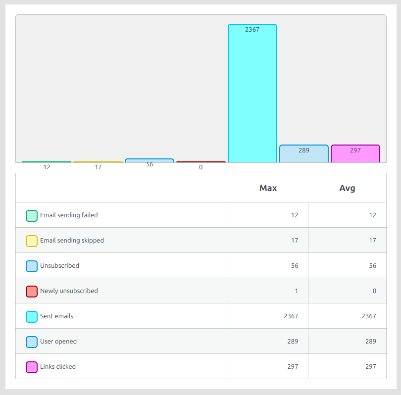
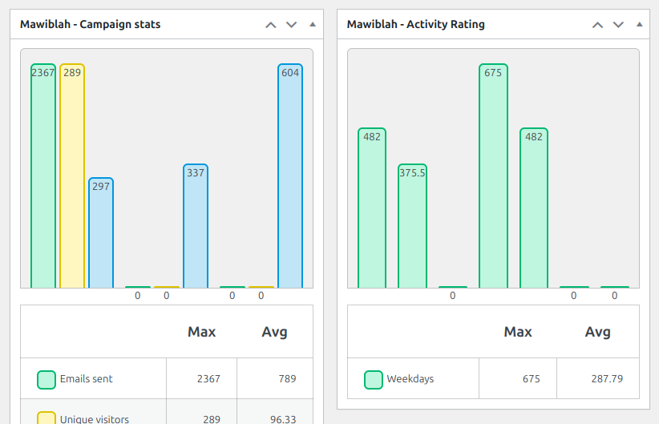
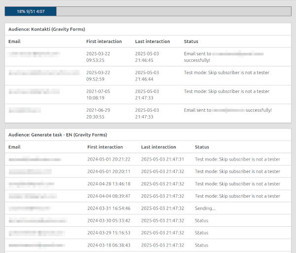

# MAWIBLAH - Mailch!mp viz blek džek end hūkers

## What is it?
- It is a WordPress plugin that sends out emails to the list of subscribers.

## Who's it for?
Generally, it's for me; it's a "weekend project" that is both useful and interesting to me.  
It could be useful for small projects with tight budgets or no income streams.  
It is not suited for sending out 100k emails. It's possible, but it will take a long time as, for now, the plugin sends "individual" emails, which is necessary in my case.

## Why?
- Good news - we have reached 2k newsletter subscribers.
- Bad news - we reached 2k newsletter subscribers.

The free tier of Mailchimp is until 2k subscribers, but the next tier is pretty expensive.
I thought maybe $5 per month or something, but no... we should spend about $50 per month. Per month, Karl.
Kind of a steep increase as our project's budget is about $100 yearly at the moment.

So... "Fine... will do my own Mailchimp... with blackjack and hookers"

## What it does
- Sends out emails to the email list.
- The email list is collected via Gravity Forms entries, but one can add the mailing list manually.
- The email template that is sent out is generated via shortcodes.
- Includes unsubscribe functionality.
- Imports a list of unsubscribed users from Mailchimp.
- Imports the audience from Gravity Form entries.
- Tracks clicks for the campaigns (both total and unique per session).
- Tracks the timing of clicks for the campaigns.
- Logs the actions.

📖 **[View detailed documentation](DOCUMENTATION.md)** for feature detailed explanations.

## Support
This is a free plugin, so support is limited.

The main idea is to create functionality that is needed for the particular project. There is no intention to make it work
on all possible configurations and setups.

## 📊 MAWIBLAH vs Mailchimp

| Feature                          | MAWIBLAH                                         | Mailchimp (Free Tier)                      | Mailchimp (Essentials / Paid)          |
|----------------------------------|--------------------------------------------------|--------------------------------------------|----------------------------------------|
| **Price**                        | Free                                             | Free (up to 500 subs, 1k emails/month)      | Starts at ~$13/month (scales by size)  |
| **Subscriber Limit**            | Unlimited (practical limits apply)               | 500 (Free), 2,500 (Essentials base)         | Scales with plan                       |
| **Email Sending**               | One-by-one (slower, lower server load)           | Batch sending via Mailchimp servers         | Batch sending, faster delivery         |
| **SMTP / Delivery Backend**     | Uses WordPress mail system (SMTP or `wp_mail`)   | Mailchimp’s dedicated infrastructure        | Same                                   |
| **Form Integration**            | Gravity Forms                                    | Native signup forms                         | Advanced forms, popups                 |
| **Email Templates**             | Shortcode-based + HTML                           | Drag-and-drop editor                        | Advanced email builder                 |
| **Automation**                  | ❌ Not available at current version              | ✅ Basic (welcome emails)                   | ✅ Multi-step automation               |
| **Click Tracking**              | ✅ Basic (clicks & timing logged)                | ✅ Basic reports                             | ✅ Advanced click stats                |
| **Open Tracking**               | ❌ No tracking at current version                | ✅                                           | ✅                                      |
| **Unsubscribe Support**         | ✅ Simple unsubscribe                            | ✅ Compliant unsubscribe handling            | ✅                                      |
| **Import/Export Subscribers**   | ✅ Manual + Gravity Forms                        | ✅                                           | ✅                                      |
| **List Segmentation**           | ✅ Basic segmentation                            | ✅ Basic segmentation                        | ✅ Advanced targeting                   |
| **Analytics & Reports**         | ✅ Basic logging                                  | ✅ Basic dashboard                           | ✅ Detailed analytics                   |
| **Support & Reliability**       | ⚠️ DIY, limited support                          | ✅ Knowledge base, community                 | ✅ Priority email/chat support         |
| **Customization**               | ✅ Full access to plugin code                    | ❌ Closed-source                             | ❌ Limited customization                |

> 💡 **MAWIBLAH** is ideal for technical users or small projects with limited budgets who need full control and no recurring cost.

## Change log

### --- 1.0.15 ---
- **New Statistics Dashboard:** Added comprehensive activity tracking:
  
  - **Subscriber Growth:** Visualizes new subscriber trends over the last 12 months.
  - **Unsubscribe Growth:** Visualizes unsubscribe trends over the last 12 months.
  - **Overall active days & Campaign start days:** Combined view to compare when campaigns are sent vs. when users are active.
  - **Activity rating:** A calculated ratio of active days to campaign start days to identify optimal sending times.
  - **Overall active hours:** Aggregated hourly click data for the last 12 campaigns.
  - **Campaigns sent emails:** Overview of sent emails vs. failure rates.
  - **Campaigns links clicked unique users:** Tracking unique user engagement across campaigns.
  - **Campaigns links clicked total:** Total link clicks including multiple clicks by the same user.

- **New Dashboard Widget:** Added a dedicated "Activity Rating" widget to the WordPress dashboard for quick access to engagement metrics.

- **Improvements & Fixes:**
  - **Fixed:** Corrected percentage calculation for clicked links in campaign stats.
  - **Fixed:** Resolved CSS conflict in bar graphs (purple vs cyan).
  - **Fixed:** Prevented PHP warnings by checking `headers_sent()` before starting sessions.
  - **Fixed:** Handled empty data scenarios in bar graphs to prevent fatal errors.
  - **Fixed:** Corrected variable name typos in dashboard templates.
  - **Fixed:** Escaped campaign titles in dashboard for better security (XSS prevention).
  - **Fixed:** Ensured `linkCLicked` returns the updated count immediately.
  - **Fixed:** Saved unsubscribe timestamp (`unsub_time`) for accurate growth tracking (with fallback to `lastInteraction`).
  - **Improved:** Split dashboard template into modular components for better maintainability.
  - **Improved:** Added campaign statistics graphs (Raw, Conversion, Links, Days, Hours) to the individual campaign edit/view screen.

- Added comprehensive campaign statistics tracking with new counters
- Implemented tracking for newly unsubscribed users per campaign (`emailsNewlyUnsubed`)
- Enhanced click tracking with dual metrics (total clicks vs unique session clicks)
- Added detailed documentation (DOCUMENTATION.md) explaining all campaign fields and counters
- Campaign statistics now update correctly during test runs
- Improved counter initialization and update mechanisms
- **Major:** Migrated audience system from Gravity Forms to WordPress native taxonomy
  - Campaigns now use `mawiblah_subscriber_category` taxonomy for audience management
  - Removed hardcoded Gravity Forms dependencies from campaign creation and email sending
  - Added `Subscribers::getAllAudiences()` to retrieve all taxonomy audiences
  - Added `Subscribers::getSubscribersByAudience()` for efficient subscriber querying via tax_query
  - Updated `Subscribers::validateAudiences()` to validate taxonomy term IDs
- **New:** Added `Campaigns::updateCampaignStats()` function to calculate and update campaign statistics from subscriber meta data
- **New:** Added `Templates::renderTable()` for rendering styled data tables using template files
- **Improved:** Campaign list now displays human-readable audience names instead of IDs
- **Fixed:** Resolved undefined property error in `Subscribers::appendMeta()` for better compatibility with both ID and id properties
- **Documentation:** Updated DOCUMENTATION.md with new API functions and taxonomy audience system explanation

### --- 1.0.14 ---
- styling fixes
- date format update 
- back to list after creating campaign
- routing and layout updates

### --- 1.0.13 ---
- Test and approval implemented
- Moved email sending to an ajax async process
- Implemented force import from gravity forms

### --- 1.0.12 ---
- Added an action page with the ability to clear logs and manually sync entries/emails with Gravity Forms.

### --- 1.0.11 ---
- Added a meta-field to the subscribers' post-type for the last interaction and updated it after an email is sent.
- Added a meta-settings field to control the time between emails to the same subscriber.
  

### --- 1.0.10 ---
- Implemented a setting to skip actual email sending for testing/debugging purposes.
- Displayed settings output on the test page.

### --- 1.0.9 ---
- Introduced a dedicated settings page in the admin interface to provide a centralized location for configuration.
- Added options to control email intervals and enable debugging with IP restrictions.
- Added the ability to toggle database logging via the settings page.
- Testing/Shout-out to [coderabit.ai](https://coderabit.ai) for the help with the code. Will see how it goes, but for now it seems helpful.
  

### --- 1.0.8 ---
- Saved click time for statistics, allowing analysis of the most "active" times for opening emails.
- Fixed a logical issue where all subscribers were flagged as having already been sent an email to that address.

### --- 1.0.7 ---
- Updated some logging mechanisms and added logging for skipped emails.

### --- 1.0.6 ---
- Fixed nonce issues for AJAX requests.

### --- 1.0.5 ---
- Fixed an issue where two messages were sent simultaneously during the unsubscribed process.

### --- 1.0.4 ---
- Fixed an issue with registering visits from link statistics.

### --- 1.0.3 ---
- Removed some debug code.
- Fixed an issue with WPML translations, likely caused by the plugin registration order. Adjusted the email template request to go through a REST request to ensure WPML initialization. 

### --- 1.0.2 ---
- added to the log function that it adds extra data to the content of the log
- fixed issue that in some cases was sending twice to the same email, issue was that in the source there was the same address  
used with some letters capitalized

### --- 1.0.1 ---
- Added a minimal action logger for debugging purposes to trace the flow of sending out campaigns.

### --- initial MVP ---
- Implemented minimal functionality to meet specific needs. Potential for making it more universal in the future.

