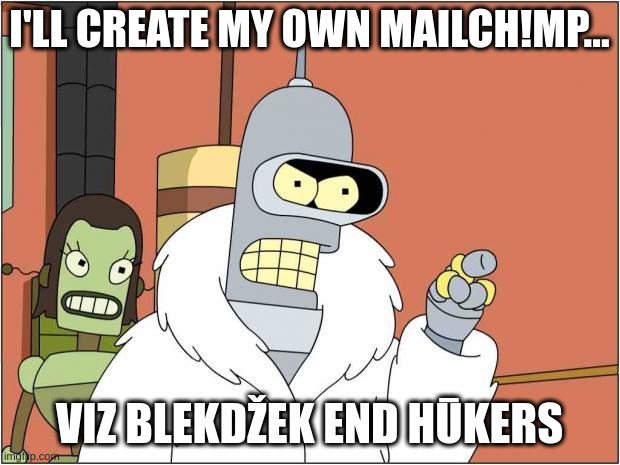
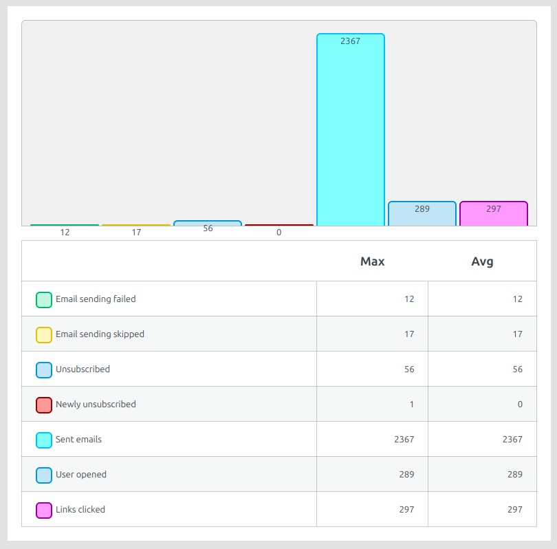
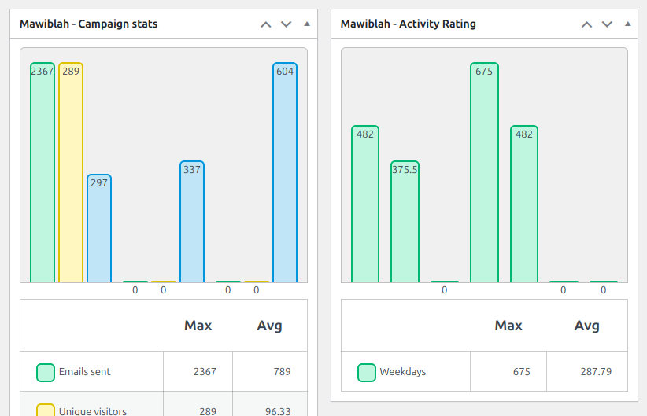
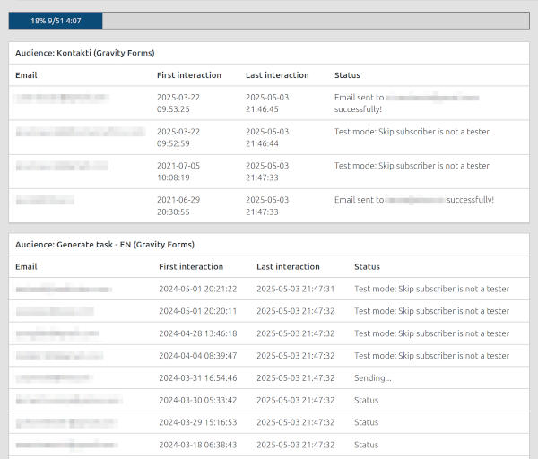
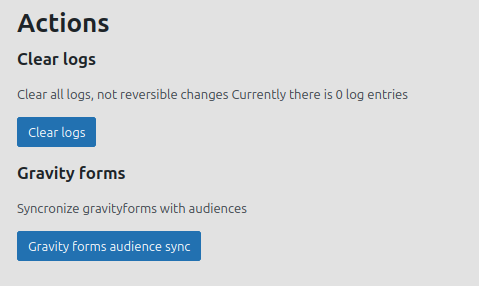
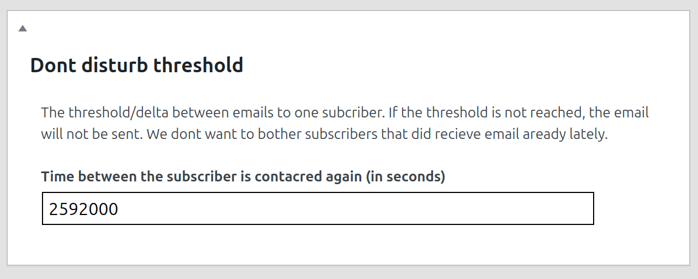
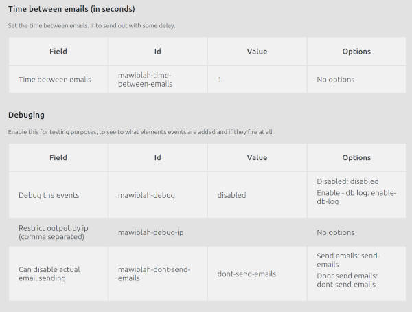
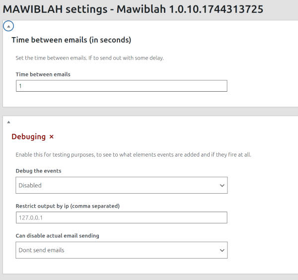
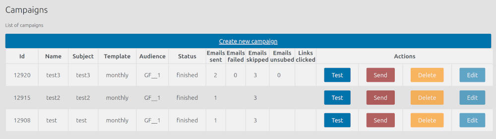

# MAWIBLAH - Mailch!mp viz blek džek end hūkers

## What is it?
- It is a WordPress plugin that sends out emails to the list of subscribers.

## Who's it for?
Generally, it's for me; it's a "weekend project" that is both useful and interesting to me.  
It could be useful for small projects with tight budgets or no income streams.  
It is not suited for sending out 100k emails. It's possible, but it will take a long time as, for now, the plugin sends "individual" emails, which is necessary in my case.

## Why?
- Good news - we have reached 2k newsletter subscribers.
- Bad news - we reached 2k newsletter subscribers.

The free tier of Mailchimp is until 2k subscribers, but the next tier is pretty expensive.
I thought maybe $5 per month or something, but no... we should spend about $50 per month. Per month, Karl.
Kind of a steep increase as our project's budget is about $100 yearly at the moment.

So... "Fine... will do my own Mailchimp... with blackjack and hookers"

## What it does
- Sends out emails to the email list.
- The email list is collected via Gravity Forms entries, but one can add the mailing list manually.
- **Native subscription form** — embed a sign-up form anywhere via `[mawiblah_subscribe_form]` shortcode or Gutenberg block, with honeypot + optional reCAPTCHA v3 spam protection.
- The email template that is sent out is generated via shortcodes.
- Includes unsubscribe functionality.
- Imports a list of unsubscribed users from Mailchimp.
- Imports the audience from Gravity Form entries.
- Tracks clicks for the campaigns (both total and unique per session).
- Tracks the timing of clicks for the campaigns.
- Logs the actions.

📖 **[View detailed documentation](DOCUMENTATION.md)** for feature detailed explanations.

## Support
This is a free plugin, so support is limited.

The main idea is to create functionality that is needed for the particular project. There is no intention to make it work
on all possible configurations and setups.

## Development

The initial version was built by hand. From version 1.0.9 onward, most changes have been made with the assistance of [CodeRabbit](https://coderabbit.ai) for code review and [Claude Code](https://claude.ai/code) for implementation.

## 📊 MAWIBLAH vs Mailchimp

| Feature                          | MAWIBLAH                                         | Mailchimp (Free Tier)                      | Mailchimp (Essentials / Paid)          |
|----------------------------------|--------------------------------------------------|--------------------------------------------|----------------------------------------|
| **Price**                        | Free                                             | Free (up to 500 subs, 1k emails/month)      | Starts at ~$13/month (scales by size)  |
| **Subscriber Limit**            | Unlimited (practical limits apply)               | 500 (Free), 2,500 (Essentials base)         | Scales with plan                       |
| **Email Sending**               | One-by-one (slower, lower server load)           | Batch sending via Mailchimp servers         | Batch sending, faster delivery         |
| **SMTP / Delivery Backend**     | Uses WordPress mail system (SMTP or `wp_mail`)   | Mailchimp’s dedicated infrastructure        | Same                                   |
| **Form Integration**            | Gravity Forms + native subscription form (shortcode & Gutenberg block) | Native signup forms      | Advanced forms, popups                 |
| **Email Templates**             | Shortcode-based + HTML                           | Drag-and-drop editor                        | Advanced email builder                 |
| **Automation**                  | ❌ Not available at current version              | ✅ Basic (welcome emails)                   | ✅ Multi-step automation               |
| **Click Tracking**              | ✅ Basic (clicks & timing logged)                | ✅ Basic reports                             | ✅ Advanced click stats                |
| **Open Tracking**               | ❌ No tracking at current version                | ✅                                           | ✅                                      |
| **Unsubscribe Support**         | ✅ RFC 8058 one-click + confirmation flow        | ✅ Compliant unsubscribe handling            | ✅                                      |
| **Import/Export Subscribers**   | ✅ Manual + Gravity Forms                        | ✅                                           | ✅                                      |
| **List Segmentation**           | ✅ Basic segmentation                            | ✅ Basic segmentation                        | ✅ Advanced targeting                   |
| **Analytics & Reports**         | ✅ Basic logging                                  | ✅ Basic dashboard                           | ✅ Detailed analytics                   |
| **Support & Reliability**       | ⚠️ DIY, limited support                          | ✅ Knowledge base, community                 | ✅ Priority email/chat support         |
| **Customization**               | ✅ Full access to plugin code                    | ❌ Closed-source                             | ❌ Limited customization                |

> 💡 **MAWIBLAH** is ideal for technical users or small projects with limited budgets who need full control and no recurring cost.

## Change log

### --- 1.0.44 ---
- **New:** a schedule can carry its own do-not-disturb threshold. Tick **Don't Disturb
  Threshold → Override the global threshold for this schedule** on a schedule and the number
  field appears, prefilled with the global value; the send that schedule starts then uses that
  number instead of the site-wide setting. A threshold of `0` sends regardless of when the
  subscriber was last contacted. Two new scheduler meta fields carry it: `override_dnd` and
  `dnd_threshold`.
- **Scope:** the override belongs to the *run*, not to the campaign. `SchedulerCron` writes it
  to the campaign as `dnd_threshold_override` just before the send starts and `CronSend` drops
  it again when the send finishes, so the same campaign sent by hand, by another schedule, or
  from the browser is unaffected. A schedule whose override is switched off clears the meta on
  its next occurrence rather than inheriting yesterday's number. The `/send-email` route, test
  sends and the campaign list all keep reading the global setting.
- **New:** `tests/Integration/SchedulerDontDisturbTest.php` — a schedule without an override
  uses the global threshold, one with an override releases a subscriber the global threshold
  would have held back, the override is gone once the send finishes, and a leftover override is
  cleared when the schedule stops asking for one.
- **New:** Tests page scenario "Scheduled Do-Not-Disturb Override" — the same resolution order
  in the browser, including that an override of `0` disables the check rather than falling back
  to the global value.

### --- 1.0.43 ---
- **New:** `email_templates/mawiblah-all-variables-test.html` — a diagnostic letter that carries
  every variable Mawiblah supports exactly once: all fourteen built-in `mawiblah_` shortcodes and
  all six static placeholders, each wrapped in a marker element that names it. Render it and
  anything left unreplaced says which variable failed, by name. It appears in the campaign
  template selector like any other template.
- **Note on the default template:** the plugin already shipped one, and still does —
  `mawiblah-newsletter-template.html`, which renders the latest 3 articles via
  `[mawiblah_newest_articles count="3"]`. Nothing about it changed; it is now covered by tests
  that fail if that stops being true. The subscription confirmation letter
  (`resubscribe-confirm`) still has no shipped HTML default and stays plain text unless a theme
  provides one.
- **New:** `tests/Integration/EmailTemplateTest.php` — the shipped letters are discoverable
  through `Templates`, the default one still lists the latest 3 articles and really renders the
  three newest posts, every registered `mawiblah_` shortcode is exercised by the diagnostic
  template, and a full `lockTemplate()` → `fillTemplate()` pass leaves no variable behind. One
  test fakes a send: it hooks `pre_wp_mail`, drives a real send through the `/send-email` route,
  and reads the letter the mailer was handed — asserting every variable is filled and that the
  `List-Unsubscribe` header carries the subscriber's real hash and token.
- **New:** `tests/Integration/SchedulerRerenderTest.php` — a weekly or monthly schedule releases
  the locked template copy, so the next occurrence re-renders with a post published since the
  last send and rewrites the archived snapshot. A one-off schedule, and a recurring one with
  `rerender_on_recurring` off, must keep the snapshot they froze.
- **New:** Tests page scenario "Default Email Templates" — the same discovery, render and
  no-leftover-variable checks, in the browser.
- **Fixed:** a subscriber belonging to no audience crashed `Subscribers::isTester()`, and with it
  the whole `/send-email` route. `get_the_terms()` answers `false` rather than an empty array
  when a post has no terms, and `appendMeta()` passed that straight through to a `foreach`.
  `$subscriber->audiences` is now always a list.
- **Fixed:** `composer test` could not run at all. The suite pinned PHPUnit `^10`, whose
  `PHPUnit\Util\Test::parseTestMethodAnnotations()` removal breaks WordPress's own test case, and
  it never declared the PHPUnit Polyfills that the WP test bootstrap requires. Now `^9.6` plus
  `yoast/phpunit-polyfills ^2`.

### --- 1.0.42 ---
- **Removed:** `[gdlnks_newsletter_title]` and `[gdlnks_newsletter_content]`. These were not
  shortcodes at all — they were two hardcoded `str_replace` calls in `Campaigns::lockTemplate()`
  and `Campaigns::fillTemplate()`, named after one particular site's theme and carried in the
  plugin for everybody. The shipped template never used them (it uses `[mawiblah_title]` and
  `[mawiblah_content]`), so nothing in a default install changes.
- **Fixed:** `[mawiblah_title]` and `[mawiblah_content]` now render the campaign being sent. They
  read the global WordPress post, and an email template is rendered outside the loop, so in a
  campaign they had been falling through to "Summary for the *month*" and the generic monthly
  message — the reason the gdlnks tags existed in the first place. `ShortCodes::setCampaign()`
  now brackets both `do_shortcode()` passes; outside a send the old post-based and default
  fallbacks are unchanged.
- **Migration:** a custom template still containing `[gdlnks_newsletter_title]` or
  `[gdlnks_newsletter_content]` will now print those tags literally in the letter. Replace them
  with `[mawiblah_title]` and `[mawiblah_content]`, which render the same values.
- **Docs:** the template documentation no longer implies a fixed list of supported tags. Any
  shortcode registered in WordPress — the plugin's, the theme's, another plugin's — is evaluated
  in the email template and in the campaign content, and the built-in `mawiblah_` shortcodes are
  documented as examples of that rather than as the vocabulary.

### --- 1.0.41 ---
- **Fix:** a scheduled campaign sent once and never again. The guard that stops a
  schedule resetting a campaign mid-send read `backgroundStarted` alone, and that
  flag is left behind when a batch arrives after the campaign has already
  finished — so every later occurrence logged "previous send still in progress"
  and was skipped. The late-batch abort now clears the flag, and the guard reads
  *started and not finished*, the definition `RestRoutes` already used for
  `running`. An install already holding a stale flag recovers without a migration.

### --- 1.0.40 ---
- **New:** the subscription form's reCAPTCHA is Disabled / v2 / v3 rather than
  Disabled / Enabled. v2 renders the checkbox and refuses to submit until it is
  ticked; v3 is unchanged. `Settings::recaptchaVersion()` answers which, and the
  stored `enabled` from when v3 was the only option is migrated to `v3` — Carbon
  Fields returns a select's default for anything outside its options, so leaving
  it would have read as *disabled*.

### --- 1.0.39 ---
- **New:** a theme can dress the subscription confirmation letter by putting
  `resubscribe-confirm.html` in its `mawiblah/email_templates/` folder, the same
  place campaign templates come from. Shortcodes are evaluated, then
  `{{confirm_url}}`, `{{site_name}}` and `{{subscriber_email}}` are filled. With
  no such file the plain-text letter is sent exactly as before.

### --- 1.0.30 ---
- **Fix:** `Settings::get_sections()` was calling `check_admin_referer('gae-settings-group-options')` on any request with non-empty `$_POST`, not just submissions of mawiblah's own settings page. Since this method is reached from `SchedulerCron::init()` on WordPress's global `init` hook (via `Settings::schedulerInterval()`/`getOption()`), it ran on every single request site-wide — so *any* POST request anywhere on the site (other plugins' settings saves, AJAX calls, even the login form) died with "The link you followed has expired," since none of those carry mawiblah's specific nonce. Now only checks the nonce when `$_GET['page']` is actually mawiblah's settings page slug.

### --- 1.0.29 ---
- **New:** `send_condition_shortcode` per-campaign field (Campaign Details meta box). Enter a shortcode name (without brackets); before each scheduled send `SchedulerCron` calls it with a `campaign_id` attribute. If the shortcode returns empty output the send is skipped and the skip is written to the activity log. Non-empty output (or no shortcode set) proceeds normally. Closes #88.
- **New:** Built-in example shortcode `[mawiblah_new_posts_since_last_sent campaign_id="N"]` — returns `"yes"` when posts have been published since the campaign's last `campaignFinished` timestamp, or empty string otherwise. Useful for digest newsletters that should only go out when there is fresh content.

### --- 1.0.28 ---
- **New:** `rerender_on_recurring` per-campaign setting (checkbox in Campaign Details, default checked). When enabled, `Scheduler::resetCampaignForResend()` clears the locked template copy before each weekly/monthly send so shortcodes, WP queries, and dynamic content are re-evaluated fresh rather than replaying the month-old snapshot. Closes #86.

### --- 1.0.25 ---
- **Removed:** Actions admin page removed. Clear Logs functionality was already present on the Logs page; Gravity Forms sync is covered by the dedicated Import section. No unique functionality remains, so the page, its submenu entry, and all associated code have been deleted. Closes #81.

### --- 1.0.24 ---
- **Fixed:** `migrateTo1021()` previously fetched all `mawiblah_log` posts in a single query (`posts_per_page => -1`), causing PHP timeout errors on sites with large log histories. The migration now processes posts in batches of 200 per request, deletes each batch, and schedules a WP-Cron event (`mawiblah_migration_1021_continue`) to continue if posts remain. Progress is visible in the daily log files. Fixes #80.

### --- 1.0.23 ---
- **Improved:** Test-mode send loop now pre-fetches a reduced subscriber list — all testers first, then up to 100 randomly-sampled non-testers — instead of iterating all subscribers in every campaign audience. A 2 000-subscriber list previously triggered 2 000 REST calls in test mode; it now triggers at most `tester_count + 100`. Closes #25.

### --- 1.0.22 ---
- **Fixed:** Test sends and real sends now use separate subscriber meta keys (`sent_test_{campaignId}` vs `sent_{campaignId}`), so testers who received the test email are no longer skipped when the real campaign runs. `testReset()` clears the test-send flags so a retest always starts clean. Fixes #43.

### --- 1.0.21 ---
- **Improved:** Test page (`mawiblah-tests`) redesigned with WordPress admin UI — postbox layout, collapsible settings section, scenario checkboxes (all selected by default), single "Run Tests" button. No more per-scenario separate buttons.
- **Improved:** Help page (`mawiblah-help`) rebuilt with WordPress admin UI — four postbox cards (Subscription Form, Developer Integration, Template Overriding, Settings Reference), native `wp-list-table` tables, `notice` callout blocks, proper `metabox-holder` wrapper so postbox header padding matches WordPress core.
- **Improved:** Campaigns, Subscribers, and Logs post types moved under the Mawiblah admin menu instead of appearing as separate top-level items. Sub-items (All, Add New, Audiences taxonomy) are registered explicitly to preserve full navigation.
- **Changed:** Logging switched from the `mawiblah_log` custom post type to daily log files (`mawiblah-YYYY-MM-DD.log`) stored in the WordPress uploads directory under `gae-logs/`. Each entry is a single line: `[timestamp] [action] message | {json context}`. The post type is no longer registered.
- **Migration:** `migrateTo1021()` — existing `mawiblah_log` post type entries are exported to the appropriate daily log file (based on `post_date_gmt`) and then permanently deleted from the database. Runs automatically on first load after update.
- **Fixed:** Subscription form test scenario (`Tests::subscriptionFormScenario`) was accessing `SubscriptionForm::subscribe()` return value as a plain array; the method returns `WP_REST_Response`, so `->get_data()` now unwraps it correctly.
- **Fixed:** Click tracking test scenario (`Tests::clickTrackingScenario`) was clearing `$_SESSION` before calling `session_start()`. PHP then restored stale session data from the session store on the first `Visits::visit()` call, making all three counters appear one behind. Fixed by starting the session first (to consume the store), then clearing.

### --- 1.0.20 ---
- **New:** "Failing Email" system audience — after a subscriber's email fails to deliver N times (configurable threshold in Settings, default 3), they are automatically added to the Failing Email audience and skipped in all future campaign sends.
- **New:** PHPMailer exceptions enabled around `wp_mail()` to capture the actual error reason (e.g. SMTP rejection message). Stored in `sent_{campaignId}_error` subscriber meta and included in the activity log.

### --- 1.0.19 ---
- **New:** Test start is now blocked when none of the campaign's audiences contain a tester subscriber. A clear error message is shown with a link back to the campaign, preventing an empty test run from being recorded.

### --- 1.0.18 ---
- **New:** `List-Unsubscribe` and `List-Unsubscribe-Post: List-Unsubscribe=One-Click` headers added to every campaign email — enables one-click unsubscribe in Gmail, Apple Mail, and other RFC 8058-compliant clients.
- **New:** `GET|POST /wp-json/mawiblah/v1/unsubscribe` REST endpoint — `POST` immediately unsubscribes (RFC 8058 one-click, used by mail clients); `GET` redirects to the existing confirmation page (used when a human clicks the header link).
- **Fixed:** `Content-Type: text/html; charset=UTF-8` header was missing from campaign emails — HTML templates now render correctly in all mail clients.

### --- 1.0.17 ---
- **New:** Native subscription form — add a sign-up form anywhere via `[mawiblah_subscribe_form audiences="hash1,hash2"]` shortcode or Gutenberg block.
- **New:** Multiple audience support — assign subscribers to one or more audiences from a single form.
- **New:** `audienceHash` — stable MD5 hash per audience term, consistent with `subscriberHash` / `campaignHash` pattern.
- **New:** Honeypot spam protection (always active, zero UX impact).
- **New:** Optional reCAPTCHA v3 support — configure site key and secret key in Settings.
- **New:** Re-subscribe confirmation flow — previously unsubscribed users receive a confirmation email before being re-added.
- **New:** reCAPTCHA v3 settings section added to the Settings page.
- **New:** PHPUnit integration test suite (`composer test`) covering subscription form, subscribers, campaigns, and click tracking.
- **New:** Jest frontend test suite (`npm test`) covering form payload, DOM state, and honeypot behaviour.
- **Improved:** Test page refactored — scenarios are now button-triggered (not auto-run on page load) and split into named, self-contained scenarios.

### --- 1.0.16 ---
- **Code Quality & Naming Consistency:** Major refactoring for better maintainability and clarity:
  - **Function Naming:** Renamed functions to accurately reflect they work with hash values (not IDs):
    - `generateSubscriberId()` → `generateSubscriberHash()`
    - `getSubscriberBySubscriberId()` → `getSubscriberBySubscriberHash()`
  - **Database Schema:** Updated subscriber meta field naming:
    - Meta key: `subscriberId` → `subscriberHash`
    - Object property: `$subscriber->subscriberId` → `$subscriber->subscriberHash`
  - **Automatic Migration:** Added migration system to automatically update existing data:
    - `migrateTo1016()` migrates all subscriber records from old to new naming
    - Handles upgrades seamlessly without data loss
    - Generates missing hashes for consistency
  - **Improved Function Signature:** `addSubscriber()` now accepts optional `$subscriberHash` parameter with auto-generation fallback
  - **Template Updates:** Updated unsubscribe form to use `subscriberHash` instead of `subscriberId`
  - **Template Placeholders:** Added new naming convention for email template placeholders:
    - New placeholders: `{campaignHash}`, `{subscriberHash}`, `{email}`
    - URL-encoded versions: `%7BcampaignHash%7D`, `%7BsubscriberHash%7D`, `%7Bemail%7D`
  - **Consistent Naming Convention:**
     - Hash values (string): Use `Hash` suffix - `subscriberHash`, `campaignHash`
     - Post IDs (integer): Use `Id` suffix - `subscriberId` (when int), `audienceId`, `campaignPostId`

### --- 1.0.15 ---
- **New Statistics Dashboard:** Added comprehensive activity tracking:
  
  - **Subscriber Growth:** Visualizes new subscriber trends over the last 12 months.
  - **Unsubscribe Growth:** Visualizes unsubscribe trends over the last 12 months.
  - **Unsubscribe Reasons:** Added a table displaying the latest unsubscribe reasons and dates.
  - **Overall active days & Campaign start days:** Combined view to compare when campaigns are sent vs. when users are active.
  - **Activity rating:** A calculated ratio of active days to campaign start days to identify optimal sending times.
  - **Overall active hours:** Aggregated hourly click data for the last 12 campaigns.
  - **Campaigns sent emails:** Overview of sent emails vs. failure rates.
  - **Campaigns links clicked unique users:** Tracking unique user engagement across campaigns.
  - **Campaigns links clicked total:** Total link clicks including multiple clicks by the same user.

- **New Dashboard Widget:** Added a dedicated "Activity Rating" widget to the WordPress dashboard for quick access to engagement metrics.

- **Improvements & Fixes:**
  - **Fixed:** Corrected percentage calculation for clicked links in campaign stats.
  - **Fixed:** Resolved CSS conflict in bar graphs (purple vs cyan).
  - **Fixed:** Prevented PHP warnings by checking `headers_sent()` before starting sessions.
  - **Fixed:** Handled empty data scenarios in bar graphs to prevent fatal errors.
  - **Fixed:** Corrected variable name typos in dashboard templates.
  - **Fixed:** Escaped campaign titles in dashboard for better security (XSS prevention).
  - **Fixed:** Ensured `linkCLicked` returns the updated count immediately.
  - **Fixed:** Saved unsubscribe timestamp (`unsub_time`) for accurate growth tracking (with fallback to `lastInteraction`).
  - **Fixed:** Resolved fatal error when `getCampaignById` returns null in email list template.
  - **Fixed:** Corrected unsubscribe link placeholder replacement logic (`{campaignHash}`).
  - **Fixed:** Handled `wp_insert_term` return values correctly to prevent fatal errors in audience creation.
  - **Security:** Added `Requires PHP: 8.0` to plugin header.
  - **Security:** Escaped email output in email list template to prevent XSS.
  - **Improved:** Split dashboard template into modular components for better maintainability.
  - **Improved:** Added campaign statistics graphs (Raw, Conversion, Links, Days, Hours) to the individual campaign edit/view screen.
  - **Improved:** Synchronized 'Unsubed' audience category with `unsubed` meta field automatically.
  - **Refactor:** Separated internal campaign IDs (`campaignPostId`) from public-facing hashes (`campaignHash`) for better security and cleaner architecture.

- Added comprehensive campaign statistics tracking with new counters
- Implemented tracking for newly unsubscribed users per campaign (`emailsNewlyUnsubed`)
- Enhanced click tracking with dual metrics (total clicks vs unique session clicks)
- Added detailed documentation (DOCUMENTATION.md) explaining all campaign fields and counters
- Campaign statistics now update correctly during test runs
- Improved counter initialization and update mechanisms
- **Major:** Migrated audience system from Gravity Forms to WordPress native taxonomy
  - Campaigns now use `mawiblah_subscriber_category` taxonomy for audience management
  - Removed hardcoded Gravity Forms dependencies from campaign creation and email sending
  - Added `Subscribers::getAllAudiences()` to retrieve all taxonomy audiences
  - Added `Subscribers::getSubscribersByAudience()` for efficient subscriber querying via tax_query
  - Updated `Subscribers::validateAudiences()` to validate taxonomy term IDs
- **New:** Added `Campaigns::updateCampaignStats()` function to calculate and update campaign statistics from subscriber meta data
- **New:** Added `Templates::renderTable()` for rendering styled data tables using template files
- **Improved:** Campaign list now displays human-readable audience names instead of IDs
- **Fixed:** Resolved undefined property error in `Subscribers::appendMeta()` for better compatibility with both ID and id properties
- **Documentation:** Updated DOCUMENTATION.md with new API functions and taxonomy audience system explanation

### --- 1.0.14 ---
- styling fixes
- date format update 
- back to list after creating campaign
- routing and layout updates

### --- 1.0.13 ---
- Test and approval implemented
- Moved email sending to an ajax async process
- Implemented force import from gravity forms

### --- 1.0.12 ---
- Added an action page with the ability to clear logs and manually sync entries/emails with Gravity Forms.

### --- 1.0.11 ---
- Added a meta-field to the subscribers' post-type for the last interaction and updated it after an email is sent.
- Added a meta-settings field to control the time between emails to the same subscriber.
  

### --- 1.0.10 ---
- Implemented a setting to skip actual email sending for testing/debugging purposes.
- Displayed settings output on the test page.

### --- 1.0.9 ---
- Introduced a dedicated settings page in the admin interface to provide a centralized location for configuration.
- Added options to control email intervals and enable debugging with IP restrictions.
- Added the ability to toggle database logging via the settings page.
- Testing/Shout-out to [coderabit.ai](https://coderabit.ai) for the help with the code. Will see how it goes, but for now it seems helpful.
  

### --- 1.0.8 ---
- Saved click time for statistics, allowing analysis of the most "active" times for opening emails.
- Fixed a logical issue where all subscribers were flagged as having already been sent an email to that address.

### --- 1.0.7 ---
- Updated some logging mechanisms and added logging for skipped emails.

### --- 1.0.6 ---
- Fixed nonce issues for AJAX requests.

### --- 1.0.5 ---
- Fixed an issue where two messages were sent simultaneously during the unsubscribed process.

### --- 1.0.4 ---
- Fixed an issue with registering visits from link statistics.

### --- 1.0.3 ---
- Removed some debug code.
- Fixed an issue with WPML translations, likely caused by the plugin registration order. Adjusted the email template request to go through a REST request to ensure WPML initialization. 

### --- 1.0.2 ---
- added to the log function that it adds extra data to the content of the log
- fixed issue that in some cases was sending twice to the same email, issue was that in the source there was the same address  
used with some letters capitalized

### --- 1.0.1 ---
- Added a minimal action logger for debugging purposes to trace the flow of sending out campaigns.

### --- initial MVP ---
- Implemented minimal functionality to meet specific needs. Potential for making it more universal in the future.

