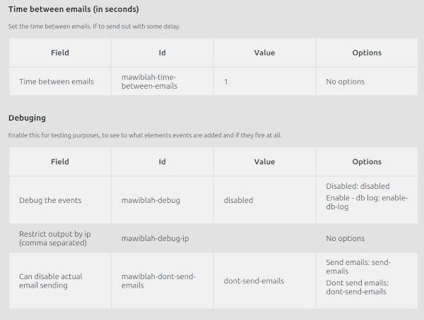

# MAWIBLAH - Mailch!mp viz blek džek end hūkers
  
## What is it?
- It is a WordPress plugin that sends out emails to the list of subscribers.

## Why?
- Good news - we have reached 2k newsletter subscribers.
- Bad news - we reached 2k newsletter subscribers.

Free tear of mailchimp is until 2k subscribers, but next tier is pretty expensive.
I thought maybe 5$ per month or something, but no... we should spend about 50$ per month. Per month Karl.
Kind of steep increase as our projects budget  is about 100$ yearly at the moment.

So... "Fine... will do my own Mailchimp... with blackjack and hookers"

## What it does
- Sends out emails to the email list.
- Email list is collected via Gravity Forms entries. But one could add the mailing list manually.
- Email template that is sent out is generated via shortcodes.
- Unsubscribe functionality
- Importing list of unsubscribed from mailchimp
- Imports audience from Gravity Form entries
- Tracking clicks for the campaigns
- Tracking click timing for the campaigns
- Logging of the actions 

## Support
This is a free plugin, so support is limited.

Main idea is to create functionality that is needed for the particular project, there is no intention to make it work
on all possible configurations and setups.

## Change log

### --- 1.0.12 ---
- Added action page, possibility to clear logs, and launch manual sync with gravity forms

### --- 1.0.11 ---
- Add meta field to the subscribers post type for last interaction, added update after email is sent
- Added meta settings field to controll the time between emails to the same subscriber
  

### --- 1.0.10 ---
- Implemented setting to skip actual email sending for testing/debugging purposes.
- Settings output in test page

### --- 1.0.9 ---
- Introduced a dedicated settings page in the admin interface, providing a centralized location for configuration.
- Added options to control email intervals and enable debugging with IP restrictions.
- Ability to toggle database logging via the settings page.
- Testing/Shout-out to [coderabit.ai](https://coderabit.ai) for the help with the code. Will see how it goes, but for now it seems helpful.
  

### --- 1.0.8 ---
- saving click time for stats, and so one could check what is most "active" time for opening emails
- fixed logical issue, all subscribers got flag that have already sent email tot hat address

### --- 1.0.7 ---
-- some logging mechanisms updated, added skipped emails logging

### --- 1.0.6 ---
-- nonce fixes for ajax requests

### --- 1.0.5 ---
-- fix for two messages at the same time at the unsub

### --- 1.0.4 ---
- fixed issue with the registering visit from link stats

### --- 1.0.3 ---
- removed some debug code 
- fixed issue with wpml translations, probably this was due to the order of plugin registration or something. And at time
when email template was read the wpml was not initialized. Rewrote that request for template would go through rest request. 

### --- 1.0.2 ---
- added to log function that it adds extra data to the content of the log
- fixed issue that in some cases was sending twice to same email, issue was that in the source there was same address 
used  with some of the letters capitalized

### --- 1.0.1 ---
- added some minimal action logger, for debugging to see why flow of sending out campaign.

### --- initial MVP ---
Minimal functionality only to achieve my needs. Maybe will make it more universal at later point in time.

## Known issues
- Texts in unsubscribe scenario is not translated

## Todo
- Bugfixes
  - Todo scenario Sent campaing -> Test -> Send again - Testing resets counter and status, so its possible same campaign to be sent out twice.
- New Features
  - Dublicate the campaing, so dont need to reset it.
  - Sand out by time (reacurance), once per month.
  - Import via files
  - Ajax email send out / cron job
  - Count email send out failures if some email has some x times failed, then mark it as failed and dont send out anymore
  - We have click time, but we need to check how the "open" email is detected and implement
  - Overall stats / welcome panel
    - Email sent stats
    - Email opened stats
    - Link clicked stats
    - Open timings stats
    - Conversion stats
- Refactoring
  - GF sync separate from audiences, so audiences would come only from "Mawiblah audiences", 
  and there would be some syncing mechanism. checking last entry. if last entry is newer than last sync, then sync. Probably best would be to have seperate import section, where users could import subscribers.
  - In test mode  get emails beforehand loop
  - more detailed wp_mail error messages, maybe have to switch to smtp mailer
  - move edit/create to the WordPress default functions, add  additional fields via hooks
- Imporvememts
  - Hide default menus or move them to the submenu
  - Default template - create default template that would work out of the box for some one that makes mistake and sets up this plugin in his wordpres project
  - Overwrite the template via hooks or templates stored in theme
- Update self tests
  - Check if there is email templates
  - Check if theme has email templates

  

